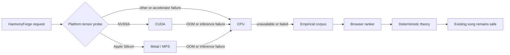

# Visual studio chord

[日本語](README.md) | **English**

[](LICENSE)
[](CHANGELOG.en.md)

## 🎹 Nothing to install. Just open it

### → **[https://uniuninaruru.github.io/Visual-studio-chord/](https://uniuninaruru.github.io/Visual-studio-chord/)**

**No Docker. No terminal, no ZIP to download, no command to type.** Open the
link and a chord progression and melody are generated on the spot. Phones and
tablets too — it is the same link.

Composing, editing, playback, and MIDI export **all run inside your browser**.
Your song is never sent anywhere ([section 8 has the
details](#8-what-is-stored-where-and-what-is-sent)).

<sub>Running it yourself, with a GPU or the neural feature, is covered by the Docker and native setups below.</sub>

---

Visual studio chord is a local-first composition workspace that generates and
edits chord progressions, melodies, voicings, and additional parts. You can
regenerate only a selected range, audition A/B/C candidates, keep playback
running while editing, and export separate MIDI tracks for a DAW.

## How to read this README

This document separates first-time use from implementation details.

| Section | Audience | Contents |
| --- | --- | --- |
| [Part 1: First-time users](#part-1-first-time-users) | No Docker, terminal, or ML experience required | Which launcher to choose, where to paste commands, and how to generate the first song |
| [Part 2: Technical reference](#part-2-technical-reference) | Developers, operators, and model researchers | Architecture, GPU runtimes, API/data contracts, security, testing, and research provenance |

You do not need to understand a backend, checkpoint, MPS, or CUDA before using
the basic composition workflow.

# Part 1: First-time users

## 1. What you do in the app

The shortest useful workflow is:

1. choose Key, Scale, Style, BPM, and Bars;
2. select **Generate**;
3. select **Play**;
4. select only the bars you want to change and regenerate chords or melody;
5. export MIDI for a DAW.

You can also import a melody MIDI and have chords written to fit it, and the
three lines in the top left open a usage guide, the release notes, the licences,
and the volume controls.

Candidate A/B/C previews do not change the current song until you explicitly
adopt one. Apply remains undoable.

## 2. Choose one launch method

| Goal | Recommended method |
| --- | --- |
| Open the app with the fewest prerequisites | [Docker CPU](#method-a-docker-the-simplest-start) |
| Use the GPU in an Apple Silicon Mac | [Native macOS with MPS](#method-b-apple-gpu-on-macos-without-docker) |
| Use an NVIDIA GPU on Windows 11 | [Native Windows with CUDA](#method-c-nvidia-cuda-on-windows-without-docker) |
| Use an NVIDIA GPU on Linux | [Native Linux with CUDA](#method-d-nvidia-cuda-on-linux-without-docker) |
| Open the desktop-hosted app on a phone | [Same-LAN phone access](#3-open-it-on-a-phone-or-tablet) |

> Apple GPU and CUDA are different runtimes. Apple Silicon uses Metal/MPS;
> CUDA requires a compatible NVIDIA GPU.

### Open a terminal in the project folder

Every command below must run inside the downloaded project folder.

- **macOS:** open Terminal, type `cd ` including the space, drag the project
  folder into the Terminal window, and press Enter.
- **Windows 11:** open the project folder in File Explorer, type `powershell`
  into the address bar, and press Enter.

Check the location:

```bash
# macOS / Linux
pwd
ls scripts
```

```powershell
# Windows PowerShell
Get-Location
Get-ChildItem .\scripts
```

If the `scripts` directory is listed, you are in the correct place.

## Method A: Docker, the simplest start

Docker packages the required Node.js and Python environment. The standard
Docker launcher uses CPU and does not require a host Python installation.

First-time preparation:

1. install [Docker Desktop](https://www.docker.com/products/docker-desktop/);
2. start Docker Desktop and wait until its engine is running;
3. download this repository with **Code → Download ZIP** and extract it;
4. open a terminal in the extracted project folder.

Start on macOS or Linux:

```bash
./scripts/start-local.sh
```

Start on Windows PowerShell:

```powershell
Set-ExecutionPolicy -Scope Process -ExecutionPolicy Bypass
.\scripts\start-local.ps1
```

The first start downloads images and can take several minutes. Keep the
terminal open. Copy the complete printed address:

```text
Desktop URL: http://127.0.0.1:5173/#access=...
```

Press `Control + C` in the terminal to stop the app.

## Method B: Apple GPU on macOS without Docker

This is for Apple Silicon Macs such as M1 through M5. It uses PyTorch MPS and
ONNX CoreML, not CUDA.

Install Node.js 24 and Python 3.12, then run once:

```bash
./scripts/setup.sh mps
./.venv/bin/python scripts/verify_acceleration.py \
  --require-torch-device mps
```

If the probe reports MPS or `GPU available: yes`, start the app:

```bash
./scripts/dev.sh
```

Open <http://127.0.0.1:5173>.

## Method C: NVIDIA CUDA on Windows without Docker

This requires Windows 11, a CUDA-capable NVIDIA GPU, and a working NVIDIA
driver. AMD and Intel GPUs are not CUDA devices.

Install Node.js 24 and Python 3.12. Confirm the driver first:

```powershell
nvidia-smi
```

Then run once inside the project folder:

```powershell
Set-ExecutionPolicy -Scope Process -ExecutionPolicy Bypass
.\scripts\setup.ps1 -Acceleration cuda
.\.venv\Scripts\python.exe .\scripts\verify_acceleration.py `
  --require-torch-device cuda
```

If the probe prints the CUDA device name, start the app:

```powershell
.\scripts\dev.ps1
```

Open <http://127.0.0.1:5173>.

## Method D: NVIDIA CUDA on Linux without Docker

After installing the NVIDIA driver, Node.js 24, and Python 3.12:

```bash
nvidia-smi
./scripts/setup.sh cuda
./.venv/bin/python scripts/verify_acceleration.py \
  --require-torch-device cuda
./scripts/dev.sh
```

Open <http://127.0.0.1:5173>.

## 3. Open it on a phone or tablet

The Mac, Windows PC, or Linux desktop performs generation and storage. The
phone is only a responsive client. Put both devices on the same trusted Wi-Fi.

```bash
# macOS / Linux
./scripts/serve-lan.sh
```

```powershell
# Windows
.\scripts\serve-lan.ps1
```

Open the complete printed `Phone URL`, including `#access=...`. Do not expose
this development launcher directly to the public internet or an untrusted
network.

## 4. First composition

1. start or skip the optional first-use tutorial (the three lines in the top
   left reopen it, and the written guide, at any time);
2. open **Basic**;
3. leave C / Major / 120 BPM / 8 bars selected for the first run;
4. select **Generate**, then **Play**;
5. select one or more bars in the piano roll or Chord Lane;
6. request a partial regeneration;
7. audition the candidates and adopt only the one you want;
8. use **Export** to download MIDI.

## 5. Recognize success and failure

| Message | Meaning | Action |
| --- | --- | --- |
| `Web app: http://127.0.0.1:5173` | The browser application started | Open that URL |
| `Local inference server: http://127.0.0.1:8765` | The local Python backend also started | Continue normally |
| `continuing in browser/theory mode` | An optional runtime is unavailable | Basic composition remains available; inspect Diagnostics |
| `ERR_CONNECTION_REFUSED` | The launcher is not running or has stopped | Return to the terminal and start it again |
| `port 5173 is already in use` | Another process owns the port | Change `MTC_FRONTEND_PORT` as described in the technical section |

## 6. Small glossary

| Term | Plain-language meaning |
| --- | --- |
| Terminal / PowerShell | A window for giving the computer text commands |
| Docker | A packaged application environment |
| CPU | The compatible default processor available on every supported computer |
| GPU | Hardware that performs many calculations in parallel |
| MPS / Metal | The PyTorch path to an Apple GPU |
| CUDA | NVIDIA's GPU-computing runtime |
| Backend | The local Python server that performs optional inference |
| Inference | Asking a trained model to calculate candidates |
| Checkpoint | A file containing trained model weights |
| MIDI | Note and performance data that a DAW can import |

## 7. Safety contract

- Generated candidates never overwrite the current song automatically.
- Neural candidates must pass schema, theory, voicing, 88-key, left/right-hand,
  and all-track checks before adoption.
- A validated preview changes the project only after explicit adoption and
  remains undoable.
- Cancel, timeout, checkpoint rejection, or inference failure does not publish
  a partial candidate.
- Songs stay in the browser; see section 8 for exactly what is sent and when.
- A missing neural model falls back to the empirical corpus, browser ranking,
  and deterministic theory workflow.

## 8. What is stored where, and what is sent

**The song itself never leaves the browser, under any launch method.** Chord and
melody generation, editing, playback, and MIDI export all run in browser
JavaScript. Songs are kept in `localStorage`, falling back to session memory
when that is unavailable. Preference learning is stored the same way, trying
IndexedDB, then `localStorage`, then memory.

Only when the backend is running are two things sent to it:

- **Candidate ranking** — per-candidate feature values (degree n-grams,
  harmonic-function ratios, and similar) together with the learned preference
  weights. These are not the notes themselves, but **for a short song of five
  chords or fewer a feature name is the chord progression**.
- **Neural inference**, and only if a checkpoint has been installed — the
  selected range, the melody, and any locked chords.

With no backend running, neither is sent. `Browser mode` in the header means no
request is being made.

The backend's preference state lives **in process memory only** and is never
written to disk; it is lost when the server stops.

### Using it with the browser alone

Generation, editing, playback, MIDI export, and preference learning all work
without starting the backend. Only two things become unavailable:

- **candidate ordering** by the 909-song empirical model — this changes the
  order A/B/C are shown in, not the music itself;
- the neural harmony preview, which needs a checkpoint that is not shipped.

## What is included

- deterministic, seeded generation with named progressions and functional
  harmony;
- variable harmonic rhythm, sections, modulation, phrase grammar, tension, and
  advanced chord vocabulary;
- the full J-pop shape at the longest length: two verse-chorus cycles, a
  bridge, then the sabi twice more as a 落ちサビ and a 大サビ — the same
  progression, set quietly and then at full height;
- no section shorter than a four-bar period wherever the piece can afford one;
- four-part/piano voicing with cadence, applied-chord, voice-leading, and
  all-track validation;
- a left hand that holds a shell — root with a fifth, seventh, octave or tenth —
  with the interval read off the bass against the low interval limits, so the
  lower it sits the wider it has to be; the hands may overlap in pitch and may
  not swap;
- melodic skeletons, contextual non-chord tones, countermelody, canon,
  polyrhythm, and groove;
- Bass / Left Hand, Chords / Right Hand, Melody, and additional DAW-style
  tracks with visibility, mute, solo, playback, and MIDI export;
- range regeneration, candidate audition, Like/Dislike preference ranking,
  Auto Fix preview, Apply, and Undo;
- light / dark / follow-the-system themes (menu → settings → 外観), with every
  colour tokenised so the chord lane and piano roll are designed for both rather
  than inverted into one;
- harmonic-function colours chosen to stay distinguishable under protanopia and
  deuteranopia — the tonic/predominant separation goes from a simulated 9.3 to
  25.8;
- preference-guided generation, off by default: the generate button draws
  several pieces and keeps the one the A/B judgements prefer, and the piece
  carries the seed of the draw that won, so it stays reproducible from that
  seed alone with no model involved;
- progression search across ~1500 catalogued and derived progressions, with
  any result applicable to the selected section — the bars keep their harmonic
  rhythm and only what each chord spells changes;
- voicing chosen by cost rather than named in a setting: a catalogue of shapes,
  low interval limits held as a rule, the melody kept audible above the
  accompaniment, and a register that moves with the section;
- melody MIDI import, with the key estimated from the melody and chords written
  to fit it;
- an explanation of what it wrote and why, per chord and for the whole piece,
  each statement naming the body of theory it comes from;
- local JSON persistence, offline operation after setup, diagnostics, and
  safe browser/theory fallbacks;
- a menu behind the three lines: usage guide, release notes, dependency
  licences, and master/per-track/reverb volume stored on the device rather than
  in the project.

The rest of this document is implementation and operations documentation.

---

# Part 2: Technical reference

## v0.4.0 scope

v0.4.0 adds the **HarmonyForge neural-harmony research-preview foundation**:
a 104,567,874-parameter masked Transformer, asynchronous API v2 jobs,
cancellation, strict checkpoint validation, and CUDA / Apple Metal (MPS) / CPU
adapters.

It does **not** include a trained HarmonyForge checkpoint. The normal product
continues to use the deterministic theory engine and an empirical chord
language model built from aggregate POP909 annotations. The optional mock is an
integration fixture and is visibly labeled `MOCK`, untrained, and unevaluated.

### Neural development is paused

With apologies to anyone who was looking forward to it: **work on the neural
harmony feature is currently stopped**, and there is no date that can honestly
be promised.

Harmony-only pre-training was run locally. Those weights cannot be loaded by the
inference path by design — they were never conditioned on a melody, so serving
them would make the interface claim a capability the model does not have.
Reaching something usable needs melody-conditioned training and a quality
evaluation, and the work paused before that.

Being honest about why: the model is too large for the data. Against 909 songs
and roughly five thousand windows, four of the six output heads never moved off
the trivial majority prediction, and generalization stopped improving after five
epochs. Getting to a quality worth shipping at this data scale needs a design
rethink, not more epochs.

**Nothing about the app is missing because of this.** Generation, editing,
playback, and MIDI export all run on the music-theory engine and the empirical
model. The neural feature was always additive, and everything that worked before
still works.

## Technical contents

| Area | Sections |
| --- | --- |
| Runtime and devices | [Optional acceleration](#optional-acceleration), [Native development and tests](#native-development-and-tests) |
| Neural model | [HarmonyForge research preview](#harmonyforge-research-preview), [Implemented model](#implemented-model), [Fallback](#fallback) |
| Contracts | [API](#api), artifact validation, cancellation, and versioned data described in the HarmonyForge section |
| Quality and provenance | [Primary v0.4 references](#primary-v04-references), [Current limitations](#current-limitations) |

## Optional acceleration

The normal native setup now installs pinned PyTorch 2.13.0 and SafeTensors
0.8.0. `auto` probes MPS on Apple silicon and CUDA on NVIDIA systems with a
real tensor operation, then safely falls back to PyTorch CPU. To change the
device profile later. The pinned PyTorch targets are Apple silicon, Windows
x64, and Linux x86_64/aarch64; Intel Mac and Windows ARM64 can use the explicit
`none` profile to skip installing PyTorch and use Browser/Theory features.
`none` does not remove an already installed runtime.

```bash
# macOS / Linux
./scripts/setup-acceleration.sh auto
```

```powershell
# Windows 11
.\scripts\setup-acceleration.ps1 auto
```

The scripts verify a real tensor operation rather than GPU presence alone.
Windows accepts `cuda`, `directml`, or `cpu`; DirectML is for the existing ONNX
ranker and is not a v0.4 HarmonyForge device. HarmonyForge on Windows uses CUDA
or CPU. macOS uses MPS when supported, and Linux uses CUDA or CPU.

Equivalent pinned dependency commands used by the scripts, CI, and Docker are:

```bash
python -m pip install --requirement backend/requirements-acceleration-cpu.lock
python -m pip install --requirement backend/requirements-acceleration-cuda.lock
python -m pip install --requirement backend/requirements-acceleration-macos.lock
python -m pip install --requirement backend/requirements-acceleration-directml.lock
```

The first three include PyTorch 2.13.0 and SafeTensors 0.8.0 as appropriate.
The ranker-only DirectML lock includes neither. The current PyPI PyTorch
distribution also brings CUDA 13 packages into the Linux resolution even when
execution is CPU-only, so the CPU lock and Docker image have a large
download/storage footprint. We keep the reproducible upstream resolution
instead of inventing a wheel source or hashes; a separately pinned official CPU
wheel source can replace it after cross-platform validation.

The standard CPU Docker image includes the pinned optional neural runtime, but
HarmonyForge remains unavailable until a valid trained checkpoint is mounted
read-only. To start the optional CUDA image:

```bash
# Linux CUDA host
./scripts/start-local.sh cuda
```

```powershell
# Windows PowerShell
.\scripts\start-local.ps1 -Backend cuda
```

This adds `compose.cuda.yaml` and requests `gpus: all`. The host needs a
compatible NVIDIA driver and the
[official NVIDIA Container Toolkit](https://docs.nvidia.com/datacenter/cloud-native/container-toolkit/latest/install-guide.html).

## HarmonyForge research preview

### Artifact layout

The real model is read only from the allowlisted layout:

```text
models/
  harmonyforge-bimask-base-v1/
    current.json
    versions/<manifest-sha256>/
      manifest.json
      data-manifest.json
      training-run.json
      harmonyforge-bimask-base-v1.safetensors
```

The manifest declares the architecture, actual config, checkpoint, and
`data-manifest.json` and `training-run.json` file SHA-256 values, the fixed
tokenizer digest, training/evaluation status, PyTorch version, minimum
application/API versions, and supported precision. The loader verifies
allowlisted filenames, actual file hashes, the tokenizer, and the architecture.
Dataset rights and leakage review remain training release gates. Separately,
the compiler verifies the data manifest’s ledger and split, vocabulary, and
statistics artifact hashes before export. Missing, untrained, unevaluated,
malformed, incompatible, or checksum-mismatched artifacts are rejected before
weights are moved to an accelerator.
The exporter publishes a fully validated immutable version first and switches
`current.json` atomically. A direct root-level artifact layout is accepted only
for legacy read compatibility and is never produced by the v0.4 writer.

Relevant environment settings:

```dotenv
MODEL_DIRECTORY=./models
NEURAL_MODEL_CONFIG=./configs/models/harmonyforge-bimask-base-v1.yaml
MTC_ENABLE_RESEARCH_CHECKPOINT=0
MTC_ENABLE_NEURAL_MOCK=0
```

`MTC_ENABLE_RESEARCH_CHECKPOINT=1` permits an explicitly research-only
artifact, but does not bypass any schema, checksum, architecture, or
compatibility check. `MTC_ENABLE_NEURAL_MOCK=1` enables only the deterministic
API/UI fixture; it does not turn the fixture into a trained music model.

### User workflow

1. Select bars in ChordLane, choose **コードのみ** (chords only) in the bottom
   regeneration dock, select Auto / Apple MPS / CUDA / CPU, and press
   **選択範囲を再生成**. Other regeneration targets keep using theory generation.
2. The editor sends melody, metre/form controls, immutable locks, generation
   mask, seed, `candidateCount: 3`, the preferred device, and
   `allowCpuFallback: true` to an API v2 background job.
3. Playback, draft editing, and manual controls remain available. The status
   area shows stage, progress, elapsed time, device, fallback reason, and
   Cancel. It says `Detecting device…` until a real probe completes.
4. Server candidates arrive as `hardRuleValidation: pendingClient` and
   `adoptable: false`.
5. The client materializes and validates each complete candidate. Invalid,
   cancelled, or context-stale results are discarded as a unit. Results
   compatible with newer edits are rebased, revalidated, and labeled `Rebased`.
6. Audition A/B/C. Only **この候補を採用** commits a validated preview to
   project/Undo history. Accelerator failure offers **CPUで再試行** for the same
   range; later failure falls back through deterministic theory generation,
   local ranking, and browser ranking.

### Implemented model

| Item | v0.4 implementation |
| --- | --- |
| Family | Time-aligned bidirectional masked, single-encoder Transformer |
| Encoder | 12 layers, hidden 768, 12 heads, FFN 4096, pre-norm, GELU |
| Position | Learned position in a 256-frame window plus bar/metre embeddings |
| Context | Melody, harmony, and bar-summary tokens |
| Extension conditioning | Existing extension multi-hot vector through a bias-free 8→768 projection |
| Outputs | Factorized event/root/quality/inversion/bass/extensions plus auxiliary function/cadence heads |
| Size | **104,567,874 parameters** |
| Artifact | One strict-manifest `SafeTensors` checkpoint |
| Devices | The same checkpoint on CUDA, MPS, and CPU |

v0.4 uses the standard PyTorch `TransformerEncoder`; it does not implement the
rotary/relative attention considered in the research plan. Those approaches,
sparse attention, stepwise stochastic-control guidance, and a causal student
remain future comparison experiments.

One forward processes one tokenizer window at
`candidate_decoding_batch: 1`. The requested 1–32 candidate variants are
seeded samples from the shared logits, so API `candidateCount` is not an
execution batch size. On accelerator OOM, v0.4 records the reason and falls
back to CPU when allowed; adaptive batch shrinking is not implemented.

### Fallback



The diagram is platform selection, not an attempt to execute CUDA and MPS on
one host. Silent MPS operation fallback is not reported as Metal execution;
the adapter records an explicit CPU fallback reason in the job and Diagnostics.

For the full processing diagram, artifact gate, prior-work mapping, and primary
sources, see the
[English architecture note](docs/neural-harmony-architecture.en.md) or the
[Japanese version](docs/neural-harmony-architecture.ja.md).

## API

API v1 remains the health/ranking/preference boundary. Neural preview jobs use:

- `POST /api/v2/harmony/generate`
- `GET /api/v2/jobs/{requestId}`
- `POST /api/v2/harmony/cancel/{requestId}`
- `GET /api/v2/models/{modelId}/manifest`

OpenAPI is exported to `backend/openapi.json`, and the frontend types are
generated from it. Client input cannot supply arbitrary checkpoint paths or
backend-native tensors.

## Native development and tests

Pinned environment: Node.js 24.14.0, pnpm 11.9.0 (npm is also supported), and
Python 3.12.10. Supported ranges are Node.js 24 and Python 3.11–3.14.

```bash
./scripts/setup.sh
pnpm typecheck
pnpm lint
pnpm test
pnpm build
(cd backend && ../.venv/bin/python -m pytest)
pnpm test:e2e
```

For explicit native setup profiles, use `./scripts/setup.sh cpu`,
`./scripts/setup.sh cuda`, or `./scripts/setup.sh mps`; on Windows use
`.\scripts\setup.ps1 -Acceleration cpu|cuda`. The normal backend CI lane
explicitly selects the internal `none` profile and stays torch-free, while the
separate neural CPU lane installs the pinned CPU lock and verifies model
construction, tokenizer behavior, checkpoint rejection, API jobs/cancel/mock
behavior, and preview safety without claiming trained musical quality. CUDA and
MPS remain real-hardware release gates.

## Primary v0.4 references

- [AutoHarmonizer paper](https://arxiv.org/abs/2112.11122) /
  [official repository](https://github.com/sander-wood/autoharmonizer):
  sixteenth-note frames and variable harmonic rhythm.
- [ReaLchords](https://proceedings.mlr.press/v235/wu24c.html):
  an offline teacher and future low-latency student.
- [Stochastic Control Guidance paper](https://proceedings.mlr.press/v235/huang24g.html) /
  [official repository](https://github.com/yjhuangcd/rule-guided-music):
  forward evaluation of non-differentiable rules.
- [Full-to-full curriculum masking](https://arxiv.org/abs/2601.16150):
  a training plan intended to discourage melody-ignoring shortcuts; no
  training result is claimed here.

The [architecture note](docs/neural-harmony-architecture.en.md) maps each cited
idea to the implementation and separates it from repository-specific
integration. It also contains the full bibliography.

## Current limitations

- No trained HarmonyForge checkpoint is bundled or advertised.
- Dataset rights review, leakage-safe compilation, training, closed-test
  metrics, ablations, cross-device equivalence, and listening tests remain.
- The POP909 n-gram model represents mostly popular-music annotations; it does
  not claim equal coverage of classical counterpoint, jazz, or game music.
- DirectML accelerates the ONNX ranker, not HarmonyForge v0.4.
- Firefox is outside the current release-gating matrix.
- A parameter count, successful tensor probe, mock response, or passing API
  test is not evidence of musical quality.

See the [compatibility matrix](docs/compatibility.md),
[release checklist](docs/release-checklist.md), bilingual
[research plan](docs/research/neural-chord-model-plan.en.md), and
[state-of-the-art review](docs/research/neural-harmonization-sota.en.md).

## License

Application code is available under the [MIT License](LICENSE). Dataset and
checkpoint rights are separate; verify each source license before training or
redistributing derived artifacts.

Copyright (c) 2026 uniuninaruru
