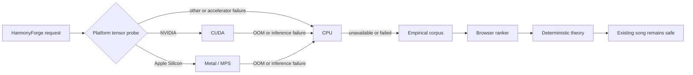

# Visual studio chord

[日本語](README.md) | **English**

[](LICENSE)
[](CHANGELOG.en.md)

Visual studio chord is a local-first composition workspace that generates and
edits chord progressions, melodies, voicings, and additional parts. You can
regenerate only a selected range, audition A/B/C candidates, keep playback
running while editing, and export separate MIDI tracks for a DAW.

v0.4.0 adds the **HarmonyForge neural-harmony research-preview foundation**:
a 104,567,874-parameter masked Transformer, asynchronous API v2 jobs,
cancellation, strict checkpoint validation, and CUDA / Apple Metal (MPS) / CPU
adapters.

It does **not** include a trained HarmonyForge checkpoint. The normal product
continues to use the deterministic theory engine and an empirical chord
language model built from aggregate POP909 annotations. The optional mock is an
integration fixture and is visibly labeled `MOCK`, untrained, and unevaluated.

## Safety contract

- Generated candidates never overwrite the current song automatically.
- Neural candidates must pass the existing schema, theory, voicing, 88-key,
  left/right-hand, and all-track checks before they can be adopted.
- A validated preview changes the project only after explicit Apply and remains
  undoable.
- Cancel, timeout, checkpoint rejection, or inference failure does not publish
  a partial candidate or change the song.
- Project data and local inference stay on your computer.
- A missing neural model falls back to the empirical corpus, browser ranking,
  and deterministic theory workflow.

## Quick start

Install and start Docker Desktop, download this repository, and run:

```bash
# macOS / Linux
./scripts/start-local.sh
```

```powershell
# Windows PowerShell
.\scripts\start-local.ps1
```

Open the printed `Desktop URL`. Choose Key, Scale, Style, BPM, and Bars under
Basic, then select Generate. Audition the returned variations and use Apply
only for the one you want. Export JSON for a recoverable project copy or MIDI
for GarageBand, Cubase, Logic Pro, Ableton Live, or another DAW.

The desktop is the local host for storage and CPU/GPU inference. A phone or
tablet on the same trusted LAN can use the printed authenticated URL as a
responsive client; it does not need its own model checkpoint.

## What is included

- deterministic, seeded generation with named progressions and functional
  harmony;
- variable harmonic rhythm, sections, modulation, phrase grammar, tension, and
  advanced chord vocabulary;
- four-part/piano voicing with cadence, applied-chord, voice-leading, and
  all-track validation;
- melodic skeletons, contextual non-chord tones, countermelody, canon,
  polyrhythm, and groove;
- Bass / Left Hand, Chords / Right Hand, Melody, and additional DAW-style
  tracks with visibility, mute, solo, playback, and MIDI export;
- range regeneration, candidate audition, Like/Dislike preference ranking,
  Auto Fix preview, Apply, and Undo;
- local JSON persistence, offline operation after setup, diagnostics, and
  safe browser/theory fallbacks.

## Optional acceleration

The normal native setup now installs pinned PyTorch 2.13.0 and SafeTensors
0.8.0. `auto` probes MPS on Apple silicon and CUDA on NVIDIA systems with a
real tensor operation, then safely falls back to PyTorch CPU. To change the
device profile later. The pinned PyTorch targets are Apple silicon, Windows
x64, and Linux x86_64/aarch64; Intel Mac and Windows ARM64 can use the explicit
`none` profile to skip installing PyTorch and use Browser/Theory features.
`none` does not remove an already installed runtime.

```bash
# macOS / Linux
./scripts/setup-acceleration.sh auto
```

```powershell
# Windows 11
.\scripts\setup-acceleration.ps1 auto
```

The scripts verify a real tensor operation rather than GPU presence alone.
Windows accepts `cuda`, `directml`, or `cpu`; DirectML is for the existing ONNX
ranker and is not a v0.4 HarmonyForge device. HarmonyForge on Windows uses CUDA
or CPU. macOS uses MPS when supported, and Linux uses CUDA or CPU.

Equivalent pinned dependency commands used by the scripts, CI, and Docker are:

```bash
python -m pip install --requirement backend/requirements-acceleration-cpu.lock
python -m pip install --requirement backend/requirements-acceleration-cuda.lock
python -m pip install --requirement backend/requirements-acceleration-macos.lock
python -m pip install --requirement backend/requirements-acceleration-directml.lock
```

The first three include PyTorch 2.13.0 and SafeTensors 0.8.0 as appropriate.
The ranker-only DirectML lock includes neither. The current PyPI PyTorch
distribution also brings CUDA 13 packages into the Linux resolution even when
execution is CPU-only, so the CPU lock and Docker image have a large
download/storage footprint. We keep the reproducible upstream resolution
instead of inventing a wheel source or hashes; a separately pinned official CPU
wheel source can replace it after cross-platform validation.

The standard CPU Docker image includes the pinned optional neural runtime, but
HarmonyForge remains unavailable until a valid trained checkpoint is mounted
read-only. To start the optional CUDA image:

```bash
# Linux CUDA host
./scripts/start-local.sh cuda
```

```powershell
# Windows PowerShell
.\scripts\start-local.ps1 -Backend cuda
```

This adds `compose.cuda.yaml` and requests `gpus: all`. The host needs a
compatible NVIDIA driver and the
[official NVIDIA Container Toolkit](https://docs.nvidia.com/datacenter/cloud-native/container-toolkit/latest/install-guide.html).

## HarmonyForge research preview

### Artifact layout

The real model is read only from the allowlisted layout:

```text
models/
  harmonyforge-bimask-base-v1/
    current.json
    versions/<manifest-sha256>/
      manifest.json
      data-manifest.json
      training-run.json
      harmonyforge-bimask-base-v1.safetensors
```

The manifest declares the architecture, actual config, checkpoint, and
`data-manifest.json` and `training-run.json` file SHA-256 values, the fixed
tokenizer digest, training/evaluation status, PyTorch version, minimum
application/API versions, and supported precision. The loader verifies
allowlisted filenames, actual file hashes, the tokenizer, and the architecture.
Dataset rights and leakage review remain training release gates. Separately,
the compiler verifies the data manifest’s ledger and split, vocabulary, and
statistics artifact hashes before export. Missing, untrained, unevaluated,
malformed, incompatible, or checksum-mismatched artifacts are rejected before
weights are moved to an accelerator.
The exporter publishes a fully validated immutable version first and switches
`current.json` atomically. A direct root-level artifact layout is accepted only
for legacy read compatibility and is never produced by the v0.4 writer.

Relevant environment settings:

```dotenv
MODEL_DIRECTORY=./models
NEURAL_MODEL_CONFIG=./configs/models/harmonyforge-bimask-base-v1.yaml
MTC_ENABLE_RESEARCH_CHECKPOINT=0
MTC_ENABLE_NEURAL_MOCK=0
```

`MTC_ENABLE_RESEARCH_CHECKPOINT=1` permits an explicitly research-only
artifact, but does not bypass any schema, checksum, architecture, or
compatibility check. `MTC_ENABLE_NEURAL_MOCK=1` enables only the deterministic
API/UI fixture; it does not turn the fixture into a trained music model.

### User workflow

1. Select bars in ChordLane, choose **コードのみ** (chords only) in the bottom
   regeneration dock, select Auto / Apple MPS / CUDA / CPU, and press
   **選択範囲を再生成**. Other regeneration targets keep using theory generation.
2. The editor sends melody, metre/form controls, immutable locks, generation
   mask, seed, `candidateCount: 3`, the preferred device, and
   `allowCpuFallback: true` to an API v2 background job.
3. Playback, draft editing, and manual controls remain available. The status
   area shows stage, progress, elapsed time, device, fallback reason, and
   Cancel. It says `Detecting device…` until a real probe completes.
4. Server candidates arrive as `hardRuleValidation: pendingClient` and
   `adoptable: false`.
5. The client materializes and validates each complete candidate. Invalid,
   cancelled, or context-stale results are discarded as a unit. Results
   compatible with newer edits are rebased, revalidated, and labeled `Rebased`.
6. Audition A/B/C. Only **この候補を採用** commits a validated preview to
   project/Undo history. Accelerator failure offers **CPUで再試行** for the same
   range; later failure falls back through deterministic theory generation,
   local ranking, and browser ranking.

### Implemented model

| Item | v0.4 implementation |
| --- | --- |
| Family | Time-aligned bidirectional masked, single-encoder Transformer |
| Encoder | 12 layers, hidden 768, 12 heads, FFN 4096, pre-norm, GELU |
| Position | Learned position in a 256-frame window plus bar/metre embeddings |
| Context | Melody, harmony, and bar-summary tokens |
| Extension conditioning | Existing extension multi-hot vector through a bias-free 8→768 projection |
| Outputs | Factorized event/root/quality/inversion/bass/extensions plus auxiliary function/cadence heads |
| Size | **104,567,874 parameters** |
| Artifact | One strict-manifest `SafeTensors` checkpoint |
| Devices | The same checkpoint on CUDA, MPS, and CPU |

v0.4 uses the standard PyTorch `TransformerEncoder`; it does not implement the
rotary/relative attention considered in the research plan. Those approaches,
sparse attention, stepwise stochastic-control guidance, and a causal student
remain future comparison experiments.

One forward processes one tokenizer window at
`candidate_decoding_batch: 1`. The requested 1–32 candidate variants are
seeded samples from the shared logits, so API `candidateCount` is not an
execution batch size. On accelerator OOM, v0.4 records the reason and falls
back to CPU when allowed; adaptive batch shrinking is not implemented.

### Fallback



The diagram is platform selection, not an attempt to execute CUDA and MPS on
one host. Silent MPS operation fallback is not reported as Metal execution;
the adapter records an explicit CPU fallback reason in the job and Diagnostics.

For the full processing diagram, artifact gate, prior-work mapping, and primary
sources, see the
[English architecture note](docs/neural-harmony-architecture.en.md) or the
[Japanese version](docs/neural-harmony-architecture.ja.md).

## API

API v1 remains the health/ranking/preference boundary. Neural preview jobs use:

- `POST /api/v2/harmony/generate`
- `GET /api/v2/jobs/{requestId}`
- `POST /api/v2/harmony/cancel/{requestId}`
- `GET /api/v2/models/{modelId}/manifest`

OpenAPI is exported to `backend/openapi.json`, and the frontend types are
generated from it. Client input cannot supply arbitrary checkpoint paths or
backend-native tensors.

## Native development and tests

Pinned environment: Node.js 24.14.0, pnpm 11.9.0 (npm is also supported), and
Python 3.12.10. Supported ranges are Node.js 24 and Python 3.11–3.14.

```bash
./scripts/setup.sh
pnpm typecheck
pnpm lint
pnpm test
pnpm build
(cd backend && ../.venv/bin/python -m pytest)
pnpm test:e2e
```

For explicit native setup profiles, use `./scripts/setup.sh cpu`,
`./scripts/setup.sh cuda`, or `./scripts/setup.sh mps`; on Windows use
`.\scripts\setup.ps1 -Acceleration cpu|cuda`. The normal backend CI lane
explicitly selects the internal `none` profile and stays torch-free, while the
separate neural CPU lane installs the pinned CPU lock and verifies model
construction, tokenizer behavior, checkpoint rejection, API jobs/cancel/mock
behavior, and preview safety without claiming trained musical quality. CUDA and
MPS remain real-hardware release gates.

## Primary v0.4 references

- [AutoHarmonizer paper](https://arxiv.org/abs/2112.11122) /
  [official repository](https://github.com/sander-wood/autoharmonizer):
  sixteenth-note frames and variable harmonic rhythm.
- [ReaLchords](https://proceedings.mlr.press/v235/wu24c.html):
  an offline teacher and future low-latency student.
- [Stochastic Control Guidance paper](https://proceedings.mlr.press/v235/huang24g.html) /
  [official repository](https://github.com/yjhuangcd/rule-guided-music):
  forward evaluation of non-differentiable rules.
- [Full-to-full curriculum masking](https://arxiv.org/abs/2601.16150):
  a training plan intended to discourage melody-ignoring shortcuts; no
  training result is claimed here.

The [architecture note](docs/neural-harmony-architecture.en.md) maps each cited
idea to the implementation and separates it from repository-specific
integration. It also contains the full bibliography.

## Current limitations

- No trained HarmonyForge checkpoint is bundled or advertised.
- Dataset rights review, leakage-safe compilation, training, closed-test
  metrics, ablations, cross-device equivalence, and listening tests remain.
- The POP909 n-gram model represents mostly popular-music annotations; it does
  not claim equal coverage of classical counterpoint, jazz, or game music.
- DirectML accelerates the ONNX ranker, not HarmonyForge v0.4.
- Firefox is outside the current release-gating matrix.
- A parameter count, successful tensor probe, mock response, or passing API
  test is not evidence of musical quality.

See the [compatibility matrix](docs/compatibility.md),
[release checklist](docs/release-checklist.md), bilingual
[research plan](docs/research/neural-chord-model-plan.en.md), and
[state-of-the-art review](docs/research/neural-harmonization-sota.en.md).

## License

Application code is available under the [MIT License](LICENSE). Dataset and
checkpoint rights are separate; verify each source license before training or
redistributing derived artifacts.

Copyright (c) 2026 uniuninaruru
