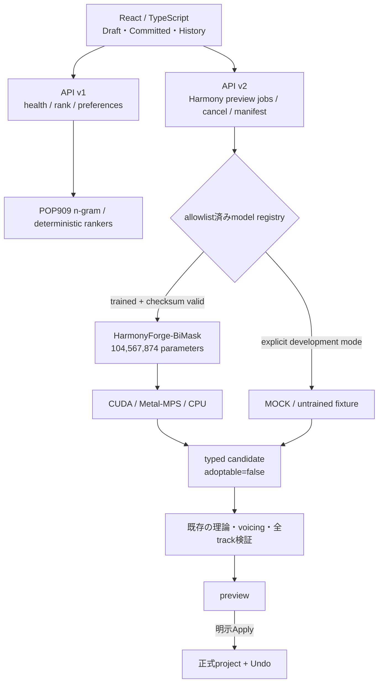

# Visual studio chord

[**日本語**](README.md) | [English](README.en.md)

[](LICENSE)
[](CHANGELOG.md)

## 🎹 インストール不要。ブラウザで開くだけです

### → **[https://uniuninaruru.github.io/Visual-studio-chord/](https://uniuninaruru.github.io/Visual-studio-chord/)**

**Dockerは要りません。ターミナルも、ZIPのダウンロードも、コマンドの入力も要りません。**
上のリンクを開けば、その場でコード進行とメロディが生成されます。

スマートフォンでもタブレットでも、リンクを開くだけです。

曲づくりも、編集も、再生も、MIDI書き出しも、**すべてあなたのブラウザの中で動きます**。
曲データがどこかへ送られることはありません（[詳しくは第8節](#8-何がどこに保存され何が送られるのか)）。

<sub>手元の環境で動かしたい方、GPUやニューラル機能を使いたい方は、この下のDocker版・ネイティブ版へどうぞ。</sub>

---

**コード進行とメロディを自動で作ってくれる、作曲の練習・アイデア出し用のアプリです。**

キーと雰囲気を選んで「生成」を押すと、音楽理論に沿った曲が1曲できます。
気に入らない部分だけを選んで作り直したり、音を直接動かしたりできます。
**曲を再生したまま編集できる**のが特徴です。

楽譜が読めなくても、音楽理論を知らなくても使えます。作った曲はMIDIファイルとして
書き出せるので、GarageBand、Logic Pro、Cubaseなどへ読み込んで続きを作れます。

## このREADMEの読み方

このREADMEは、必要な知識が違う人同士で説明が混ざらないように2部構成にしています。

| 読む場所 | 対象 | 書いてあること |
| --- | --- | --- |
| [Part 1：初めて使う人向け](#part-1初めて使う人向け) | ターミナルやDockerに慣れていない人 | どの起動方法を選ぶか、コマンドをどこへ貼るか、最初の曲を作るまで |
| [Part 2：技術者向け](#part-2技術者向けリファレンス) | 開発・検証・モデル運用を行う人 | アーキテクチャ、GPU、API、データ契約、セキュリティ、テスト、研究根拠 |

最初に試すだけならPart 1だけで十分です。コードの仕組みやモデル構成を理解してから
使う必要はありません。

# Part 1：初めて使う人向け

## 1. まず何ができるのか

基本的な流れは次の5操作です。

1. キー、雰囲気、テンポ、小節数を選ぶ
2. **この設定で生成**を押す
3. **Play**を押して聴く
4. 気に入らない小節だけ選び、コードまたはメロディを作り直す
5. **Export**からMIDIを書き出す

さらに次の操作も画面から利用できます。

- Bass / Left Hand、Chords / Right Hand、MelodyをDAWのようなトラックで確認
- 対旋律、カノン、ポリリズム低音の追加
- 88鍵全域を使った音域指定
- Auto Fixによる理論エラーやトラック衝突の診断
- Like / Dislikeによる候補の並べ替え
- Undo / Redo、JSON保存、マルチトラックMIDI書き出し

## 2. 起動方法を選ぶ

迷った場合は、この表だけで選べます。

| やりたいこと | 選ぶ方法 |
| --- | --- |
| とにかく画面を開いて試したい | [Dockerで起動](#方法aいちばん簡単なdocker起動) |
| Apple Silicon MacのGPUを使いたい | [macOSネイティブ＋Apple MPS](#方法bmacosでapple-gpuを使うdockerなし) |
| WindowsのNVIDIA GPUを使いたい | [Windowsネイティブ＋CUDA](#方法cwindowsでnvidia-cudaを使うdockerなし) |
| LinuxのNVIDIA GPUを使いたい | [Linuxネイティブ＋CUDA](#方法dlinuxでnvidia-cudaを使うdockerなし) |
| 同じWi-Fiのスマートフォンから使いたい | [スマートフォンから開く](#3-スマートフォンから開く) |

> **Apple GPUとCUDAは別物です。** Apple SiliconはMetal/MPS、NVIDIA GPUはCUDAを
> 使います。Apple GPUでCUDAを動かす設定はありません。

### 「ターミナルでこのフォルダを開く」とは

このREADMEのコマンドは、ダウンロードしたプロジェクトフォルダの中で実行します。

- **macOS**：ターミナルを開き、`cd `まで入力した後、プロジェクトフォルダを
  ターミナルへドラッグしてEnterを押します。
- **Windows 11**：エクスプローラーでプロジェクトフォルダを開き、上部の
  アドレス欄へ `powershell` と入力してEnterを押します。

正しいフォルダにいるか分からない場合は、次を実行します。

```bash
# macOS / Linux
pwd
ls scripts
```

```powershell
# Windows PowerShell
Get-Location
Get-ChildItem .\scripts
```

`scripts`の中身が表示されれば、その場所で合っています。

## 方法A：いちばん簡単なDocker起動

Dockerは、アプリ専用の小さな実行環境をまとめて起動する仕組みです。この方法では
Node.jsやPythonを個別に準備する必要がありません。標準Docker構成はCPUを使います。

### 最初の1回だけ

1. [Docker Desktop](https://www.docker.com/products/docker-desktop/)をインストールする
2. Docker Desktopを起動し、画面に「Engine running」と表示されるまで待つ
3. GitHubの緑色の **Code** → **Download ZIP** からこのアプリを保存し、ZIPを展開する
4. 前節の方法で、展開したフォルダをターミナルまたはPowerShellで開く

### 起動する

macOS / Linux：

```bash
./scripts/start-local.sh
```

Windows 11 PowerShell：

```powershell
Set-ExecutionPolicy -Scope Process -ExecutionPolicy Bypass
.\scripts\start-local.ps1
```

初回は必要なファイルをダウンロードするため時間がかかります。処理中はウィンドウを
閉じないでください。最後に次のような行が表示されます。

```text
Desktop URL: http://127.0.0.1:5173/#access=...
```

`Desktop URL:`の後ろを省略せずブラウザへ貼り付けます。アプリを終了するときは、
ターミナルで `Control + C` を押します。

## 方法B：macOSでApple GPUを使う（Dockerなし）

対象はM1、M2、M3、M4、M5などのApple Silicon Macです。Apple GPUではCUDAではなく
PyTorch MPS / ONNX CoreMLを使用します。

### 最初の1回だけ

1. [Node.js](https://nodejs.org/) 24系をインストールする
2. [Python](https://www.python.org/downloads/) 3.12をインストールする
3. プロジェクトフォルダで次を実行する

```bash
./scripts/setup.sh mps
```

セットアップが終わったら、Apple GPUで実際に計算できることを確認します。

```bash
./.venv/bin/python scripts/verify_acceleration.py \
  --require-torch-device mps
```

エラーが出ず `MPS` または `GPU available: yes` と表示されれば準備完了です。

### 2回目以降の起動

```bash
./scripts/dev.sh
```

ブラウザで <http://127.0.0.1:5173> を開きます。

## 方法C：WindowsでNVIDIA CUDAを使う（Dockerなし）

対象はNVIDIA GPUを搭載したWindows 11 PCです。AMD / Intel GPUはCUDAとしては
利用できません。

### 最初の1回だけ

1. NVIDIA公式ドライバーをインストールする
2. [Node.js](https://nodejs.org/) 24系をインストールする
3. [Python](https://www.python.org/downloads/) 3.12をインストールする
4. PowerShellで次を実行し、GPU名が表示されることを確認する

```powershell
nvidia-smi
```

続いてプロジェクトフォルダで実行します。

```powershell
Set-ExecutionPolicy -Scope Process -ExecutionPolicy Bypass
.\scripts\setup.ps1 -Acceleration cuda
.\.venv\Scripts\python.exe .\scripts\verify_acceleration.py `
  --require-torch-device cuda
```

`CUDA device:`の後ろにGPU名が表示されれば準備完了です。

### 2回目以降の起動

```powershell
.\scripts\dev.ps1
```

ブラウザで <http://127.0.0.1:5173> を開きます。

## 方法D：LinuxでNVIDIA CUDAを使う（Dockerなし）

NVIDIAドライバー、Node.js 24系、Python 3.12を用意した後、次を実行します。

```bash
nvidia-smi
./scripts/setup.sh cuda
./.venv/bin/python scripts/verify_acceleration.py \
  --require-torch-device cuda
./scripts/dev.sh
```

ブラウザで <http://127.0.0.1:5173> を開きます。

## 3. スマートフォンから開く

曲の生成処理はMacまたはWindows PCで行い、スマートフォンはその画面へ接続します。
PCとスマートフォンを同じ信頼できるWi-Fiへ接続してください。

macOS / Linux：

```bash
./scripts/serve-lan.sh
```

Windows：

```powershell
.\scripts\serve-lan.ps1
```

表示された `Phone URL:` をスマートフォンへ送って開きます。`#access=...` 部分も
認証情報なので省略しないでください。**この起動方法で立てたサーバー**は、公共Wi-Fiや
インターネットへ直接公開しないでください。URLに含まれるトークンを見た人は誰でも
APIを使えるため、手元の信頼できるネットワーク専用です。

## 4. 画面が開いたら最初にすること

1. 初回チュートリアルを開始する。不要ならスキップできます
2. 左側の **Basic** を開く
3. Keyは `C`、Scaleは `Major`、BPMは `120`、Barsは `8` のままでよい
4. **この設定で生成**を押す
5. 画面上部の **Play** を押す
6. ピアノロールまたはChord Laneで、再生中の小節が移動することを確認する
7. 小節を選択して部分再生成を試す
8. 候補を聴き、気に入ったものだけ **この候補を採用**する
9. **Export**からMIDIを書き出す

候補を採用するまで元の曲は変わりません。採用後もUndoで戻せます。

## 5. 「成功」と「失敗」の見分け方

| 表示 | 意味 | 次にすること |
| --- | --- | --- |
| `Web app: http://127.0.0.1:5173` | 画面のサーバーが起動した | URLをブラウザで開く |
| `Local inference server: http://127.0.0.1:8765` | Pythonバックエンドも起動した | そのまま使う |
| `continuing in browser/theory mode` | GPUまたはPython機能が使えず、安全な基本モードへ切り替わった | 基本機能は使用可能。Diagnosticsで原因を確認 |
| `ERR_CONNECTION_REFUSED` | 起動コマンドが動いていない、または終了した | ターミナルへ戻り、起動コマンドを再実行 |
| `port 5173 is already in use` | 別のアプリが同じ番号を使用している | [ポート変更手順](#ポート5173が使用中と言われる)を使う |

## 6. 知らなくても使える用語集

| 用語 | かんたんな意味 |
| --- | --- |
| ターミナル / PowerShell | PCへ文字で命令を入力する画面 |
| Docker | アプリに必要な環境をひとまとめにして起動する仕組み |
| CPU | どのPCにもある標準的な計算装置。遅くても最も互換性が高い |
| GPU | 大量の計算を並列に処理する装置 |
| MPS / Metal | Apple GPUをPyTorchから使う仕組み |
| CUDA | NVIDIA GPUを計算へ使う仕組み |
| バックエンド | 候補の並べ替えとニューラル推論だけを行うローカルPythonサーバー。曲の生成と保存はブラウザ側です |
| 推論 | 学習済みモデルへ入力を渡し、候補を計算すること |
| checkpoint | 学習済みモデルの重みを保存したファイル |
| MIDI | DAWへ渡せる、音符と演奏情報のファイル |

## 7. データが消えたり勝手に変わったりしないための設計

- AI候補は **この候補を採用** を押すまで正式データになりません
- Cancelや推論失敗では中間候補を保存しません
- 採用後もUndoで戻せます
- 同じシードと設定から同じ曲を再生成できます
- 曲データはブラウザの保存領域に置かれ、外部サービスへ送信しません
- 保存状態、オフライン状態、実際に使った推論デバイスを画面へ表示します

## 8. 何がどこに保存され、何が送られるのか

**曲そのものは、どの起動方法でもブラウザの外へ出ません。** コード進行とメロディの
生成、編集、再生、MIDI書き出しは、すべてブラウザ内のJavaScriptで完結します。
保存先は localStorage で、使えない場合はそのセッションのメモリだけになります。
好みの学習も IndexedDB → localStorage → メモリ の順に、ブラウザ内へ保存します。

バックエンドを起動している場合だけ、次の2つが送られます。

- **候補の並べ替え** — 候補ごとの特徴量（度数のn-gram、和声機能の比率など）と、
  学習済みの好み重み。音符そのものではありませんが、**5和音以下の短い曲では
  特徴量の名前がコード進行そのものになります**
- **ニューラル推論**（checkpointを設置した場合のみ） — 選択範囲、旋律、
  ロック済みコード

バックエンドが起動していなければ、どちらも送られません。画面右上が
`Browser mode` と表示されているときは、通信が発生していない状態です。

サーバー側の好み学習は**プロセス内のメモリのみ**で、ディスクへは書きません。
停止すると消えます。

### ブラウザだけで使う

バックエンドを起動しなくても、生成・編集・再生・MIDI書き出し・好み学習は
すべて使えます。使えなくなるのは次の2つだけです。

- 909曲の経験則モデルによる**候補の並べ替え**（曲の中身ではなく、A/B/Cの表示順）
- ニューラル和声プレビュー（もともとcheckpoint未同梱で使えません）

## スクリーンショット


ここまでで通常利用の説明は終了です。以下は、実装、運用、研究モデル、API、
テストを確認する人向けの情報です。

---

# Part 2：技術者向けリファレンス

## v0.4.0の位置づけ

v0.4.0では、論文と実装計画に基づくニューラル和声プレビュー基盤を追加しました。
旋律、選択範囲、ロック済みコードを条件にする104,567,874 parameterの
`HarmonyForge-BiMask`、非同期API v2、cancel、checkpoint検証、
CUDA / Apple Metal（MPS）/ CPU adapterを実装しています。

ただし、**学習済みcheckpointは同梱していません**。通常の利用では、909曲の
コード注釈から学習した経験則モデルと、論文に基づく制約探索を使用します。
開発用mockは明示的に有効化した場合だけ使用でき、画面とAPIの両方で
「MOCK・未学習」と表示されます。

### ニューラル機能の開発を一旦止めています

期待してくださっていた方には申し訳ないのですが、**ニューラル和声機能の開発を
現在停止しています**。使えるようになる時期をお約束できる状態にありません。

和声のみの事前学習まではローカルで実行しました。ただしその重みは設計上、
推論経路へ読み込めません（メロディ条件付きで学習していないため、能力表示が
実態と食い違ってしまいます）。実際に使えるようにするにはメロディ条件付きの
学習と品質評価が必要で、そこへ進む前に区切りをつけた形です。

正直なところ、909曲・約5千windowという規模に対してモデルが大きすぎることも
分かってきました。検証では6つの出力のうち4つが自明な多数派予測から動かず、
汎化は5エポックで頭打ちになりました。この規模のデータで意味のある品質へ
届かせるには、設計から見直す必要があります。

**アプリの機能そのものは、これで欠けたりしません。** コード進行とメロディの生成、
編集、再生、MIDI書き出しはすべて音楽理論エンジンと経験則モデルで動いており、
ニューラル機能はもともと「あれば加わる」位置づけでした。今できることは
今までどおり全部できます。

## 技術者向け目次

| 分野 | 参照先 |
| --- | --- |
| 実装済み音楽機能 | [主な機能](#主な機能)、[UI操作仕様](#ui操作仕様)、[生成と好み学習](#生成と好み学習の仕組み) |
| 実行環境 | [技術スタック](#技術スタック)、[Docker構成](#docker構成と起動技術者向け詳細)、[ネイティブ構成](#ネイティブ構成と起動技術者向け詳細)、[GPU高速化](#gpu高速化任意) |
| ニューラルモデル | [HarmonyForge研究プレビュー](#ニューラル和声プレビューv04研究プレビュー)、[モデル配置と検証](#ニューラル和声プレビューv04研究プレビュー) |
| システム設計 | [アーキテクチャ](#アーキテクチャ)、[状態とエラー](#状態表示とエラー時の動作)、[設定と診断](#設定と診断) |
| 安全性と再現性 | [セキュリティ](#セキュリティ)、[品質チェック](#品質チェック)、[再現性](#再現性と設定ファイル) |
| 契約と保守 | [APIとデータ契約](#apiとデータ契約)、[ディレクトリ](#ディレクトリ)、[ロードマップ](#ロードマップ)、[参考資料](#参考にした音楽理論資料) |

## 主な機能

**生成（画面から使えます）**

- Major / Natural Minor / Harmonic Minor / Dorian / Mixolydian
- 7th、セカンダリードミナント、借用和音、トライトーン代理、sus / add9
- コード候補を1個ずつ抽選せず、終止・適用和音の実根音解決・共通音・固定声部数の実ボイスリーディング距離を全曲単位で検査
- 機能和声のクロマティック区間ではNeo-Riemannian P / L / Rを実コード候補として生成し、変換元と操作をプロジェクトへ保存
- 王道進行・小室進行・丸サ進行・カノン進行・循環コードなど、実務者の合意がある**名前付きコード進行**をID指定で選択可能（33種）
- 9th / 11th / 13th 等のテンション、分数コード（スラッシュベース）に対応
- Verse-Chorus / AABA / 通作形式の**曲構造（セクション）**生成 — セクションごとに固有のコード進行
- 最終セクションの**転調**（半音・全音・短3度上などのキー変化）
- メロディが和声と異なるモードを取る**複調**、ヨナ抜き/ニロ抜き**ペンタトニック旋律**
- 固定シードによる再現可能なコード・メロディ生成
- 強拍・フレーズ端をコードトーンへ置き、経過音や刺繍音は前後関係から説明できる場合だけ残す旋律品質チェック
- 大跳躍後の反対方向への順次進行、フレーズ頂点、音域の弧を考慮した歌える旋律
- A/B/C候補をプレビューし、採用時だけ正式データへ反映

**曲づくりアシスト（Advanced画面から使えます）**

Advancedタブの「曲の流れ（Phase A）」「歌えるメロディ（Phase B）」「和音を豊かに（Phase C）」「ノリと多声部（Phase D）」から選べます。各項目には「何が変わるか」を日本語で表示します。すべて**任意指定**で、選ばなければ従来の生成結果を維持します。

| 設定 | 内容 |
| --- | --- |
| `harmonicRhythm` | 1小節1コードの制約を外し、コードを tick 単位のスロットに配置。終止に向けた和声リズムの加速も指定可 |
| `phraseGrammar` | 「提示 → 応答 → 断片化 → カデンツ」という古典的な楽節構造でフレーズを区分 |
| `functionalHarmony` | 進行を度数テンプレートの展開ではなく、序数化した和声機能の状態遷移探索として生成。Advancedでは終止制約を保ったままNeo-Riemannian P / L / R候補も使用 |
| `voiceLeading` | 「左手はベース、右手は3声」のピアノ配置として和音を生成。共通音を残しながら3rd / 7thを滑らかにつなぎ、連続5度・連続8度・声部交差・限定進行音の未解決を回避 |
| `melodicSkeleton` | フレーズの開始音・頂点・終止を先に決め、その間を補間した音域に旋律を寄せる（`phraseGrammar` が必要） |
| `nonChordTones` | 経過音・刺繍音・アポジャトゥーラ・先取音・掛留・逆行掛留・逸音・囲い込みを「準備→不協和→解決」の3音一組で生成 |
| `pivotModulation` | キーが変わる継ぎ目の直前を、両キーにダイアトニックな和音に書き換えて転調を準備 |
| `euclideanRhythm` | 指定数の音を等間隔に配置。トレシージョ E(3,8)、シンキージョ E(5,8)、ボサノヴァ E(5,16) などが得られます |
| `groove` | グリッド上の正確な配置をやめ、スウィング・シャッフル・ボサ・バックビートなど8種のグルーヴで演奏 |
| `arrangement` | 対旋律・カノン・ポリリズム低音を追加声部として生成。声部ごとに音色、色、MIDIチャンネルを保持 |

**Auto Fix mode**

画面中央の「この曲を診断」を押すと、現在の緊張カーブ、フレーズ設定、ボイスリーディング、グルーヴ、多声部、全トラック同時再生時の衝突を調べ、実装済み機能だけで修正版を作ります。

- 診断だけでは現在の曲を変更しません
- 直す内容と理由、データ検証結果、対旋律チェックを先に表示します
- 「修正版を生成して適用」を押したときだけ正式データになります
- 適用後もUndoで元の曲へ戻せます
- 同じ曲・同じシードなら同じ修正版になります
- Auto Fixはコードへ7thの彩りと控えめな機能和声探索を追加し、修正後に音域外、低音の密集、手の交差、旋律の未解決不協和、対旋律・カノンの衝突を再検査します

**音楽理論エンジン（解析API・一部は生成へ接続済み）**

生成された曲や手入力の進行を「読む」ための関数群です。曲の出力には影響しません。

- **緊張カーブ／エネルギー曲線** — 和声・旋律・リズムから小節ごとの緊張度を測定し、セクション別の目標エネルギーを計画
- **ガイドトーンライン** — 各和音の3rdと7thを、担う構成音を交替しながら最小移動でつなぐ2声を算出
- **モーダルインターチェンジ** — 平行スケール群から借用和音の語彙を体系的に生成（Cメジャーで46和音）、スタイル別の重み付き
- **コードスケール理論** — 各和音に合うスケールを15種から照合し、利用可能音・アヴォイドノート・到達できるテンションを報告
- **リハーモナイゼーション** — 既存メロディに対し、ダイアトニック代理・セカンダリードミナント・裏コード・モーダルインターチェンジ・経過減和音・バックドアドミナント・ペダルポイント・分数コード・クロマティックメディアントの9技法から候補を生成し、旋律適合・機能的進行・スタイル適合で採点
- **クロマティックメディアント／対称和声** — 三度関係の和音を共通音数で分類し、全音音階・オクタトニックとその和音を算出
- **高度コード進行解析** — 適用和音の解決、クロマティック連続数、共通音損失、固定声部数で比較可能な実ボイスリーディング距離、根音と実ベースの上昇／下降を別々に報告
- **Neo-Riemannian変換** — P / L / Rを候補生成へ接続。Tonnetz経路長を万能距離としては使わず、変換関係を保存後にも再検証

**多声部の生成・再生・表示・書き出し**

- **DAW型トラック管理** — `ALL`で全トラックを重ねて確認、トラック名で単独表示、`V`で表示、`M`でミュート、`S`でソロ。再生と書き出しも同じトラック分割を使用
- **Bass / Left Hand** — 各和音の最低音を左手・低音トラックとして独立
- **Chords / Right Hand** — 残りの和声音を右手トラックとして独立
- **Melody** — 主旋律を独立トラックとして表示・編集
- **対旋律** — 平行5度・平行8度・声部交差を避け、反行の度合いを指定できる第2声部
- **カノン／模倣** — 旋律を遅延して再現し、現在の和音と主旋律に衝突する音は鳴らさない
- **ポリリズム／ポリメーター** — 小節に対して異なる周期を持つ層と、両者が揃うまでの小節数の算出

対旋律・カノン・ポリリズム低音は `GeneratedComposition.voices[]` に保存され、次の経路が同じ声部データを使用します。

- Tone.js再生（左手低音、右手和音、主旋律、追加声部を分離し、ミュート／ソロ対応）
- ピアノロール（A0〜C8の88鍵、トラック別の色・表示・選択、主旋律は従来どおり編集可能）
- Standard MIDI File（Bass / Left Hand、Chords / Right Hand、Melody、各追加声部を別トラック化）
- JSONプロジェクトschema v2（旧schema v1は安全に移行、新しい未知schemaは拒否）

**コードの彩り**

Advanced画面の「コードの彩り」は、理論用語を理解していなくても段階を選べます。

- **シンプル** — 三和音中心
- **豊か** — 7thを追加
- **カラフル** — 7th、借用和音、セカンダリードミナント、機能和声探索
- **冒険的** — クロマティックな選択肢と探索量を増加

借用和音などのクロマティックな和音は3個以上連続させず、1〜2個で元の調へ戻します。セカンダリードミナントとトライトーン代理は、次に実際に鳴るコードの度数と根音が宣言したターゲットへ解決する場合だけ採用します。

**編集**

- 再生を継続したまま、次の拍・小節・ループ境界で編集を安全に反映
- ノート追加、複数選択、ドラッグ、コピー、ペースト、複製、クオンタイズ、削除
- 小節ロック、コード直接編集、部分再生成、候補試聴
- Undo / Redo、履歴名変更、履歴比較、任意履歴の復元

**学習と入出力**

- Like / Dislike / Favorite / A-B選択によるカテゴリ別の好み学習
- JSONプロジェクト入出力、左手低音＋右手和音＋主旋律＋追加声部のマルチトラックMIDI出力
- プロジェクトは localStorage → セッション内メモリ、好み学習は IndexedDB → localStorage → メモリへ段階的にフォールバック

**UIと環境**

- 環境診断、初回チュートリアル、Basic / Advanced / Developer 設定
- キーボード操作、狭い画面のドロワー、固定Transport、横スクロール可能なピアノロール
- 同一LAN内のスマートフォン・タブレットから利用可能

## 技術スタック

| 領域 | 使用技術 |
| --- | --- |
| フロントエンド | React 19 / TypeScript / Vite |
| 状態管理 | Zustand（Draft / Committed / History） |
| 音声 | Tone.js、`@tonejs/midi`、`@tonaljs/tonal` |
| バックエンド | FastAPI / Uvicorn（Python 3.12.10） |
| テスト | Vitest、Playwright（Chromium / WebKit）、pytest、ruff、ESLint |
| 実行環境 | Docker Compose、GitHub Actions、Node.js 24.14.0 |

## Docker構成と起動（技術者向け詳細）

Docker Desktop または Docker Engine + Compose v2 があれば、ホスト側の Node.js や Python は不要です。

先に Docker Engine が起動していることを確認します。

```bash
docker version
docker compose version
```

`docker version` に `Server` 欄が表示されない場合は、Docker Desktop を起動してから再実行してください。

macOS / Linux:

```bash
./scripts/start-local.sh
```

Windows 11 PowerShell:

```powershell
.\scripts\start-local.ps1
```

起動スクリプトは、推測されにくい一時アクセストークンを起動ごとに生成し、固定digestのCPU版backend/frontendをビルドしてComposeで起動します。トークンを `.env` へ永続保存する必要はありません。`docker compose up` を直接実行して `MTC_SHARED_TOKEN is missing` と表示された場合も、上記スクリプトから起動してください。初回だけベースイメージと固定依存関係の取得に時間がかかり、2回目以降はDockerのキャッシュを再利用します。

起動ログには2種類のURLが表示されます。

- `Desktop URL`: 同じPCで開くURL
- `Phone URL`: 同じ信頼できるLAN内のスマートフォンやタブレットで開くURL

必ず、ログに表示された `#access=...` 付きURLをそのまま開いてください。認証情報はURLフラグメントからブラウザのセッション領域へ移され、アドレス欄から直ちに削除されます。終了は `Control + C`、コンテナの停止は `docker compose down` です。

> **注意:** 公共Wi-Fiやインターネットへポート5173を直接公開しないでください。この構成は自宅・制作室などの信頼できるローカルネットワーク向けです。

ポート5173が使用中の場合は、起動前に別ポートを指定できます。

```bash
# macOS / Linux
MTC_FRONTEND_PORT=5174 ./scripts/start-local.sh
```

```powershell
# Windows 11 PowerShell
$env:MTC_FRONTEND_PORT = "5174"
.\scripts\start-local.ps1
```

### Docker実機検証

2026-07-22に macOS arm64 の Docker Desktop 4.83.0（Engine 29.6.2、Compose 5.3.1）で次を確認済みです。

- 固定digestからCPU版backend/frontendをクリーンビルドできる
- 両コンテナがhealthyになり、UIとsame-origin APIがHTTP 200を返す
- Docker内のPython 3.12.10 / Linux aarch64 / CPU runtimeで決定的rankが成功する
- 認証なしは401、誤トークンは403、正しいセッショントークンは200になる
- 390×844のChromiumで認証フラグメントが消去され、Local server / Local CPUとして主要操作が表示される
- `docker compose down` でコンテナとネットワークを正常終了できる

Linux Docker build は GitHub Actions でも検証しています。Windows NVIDIA CUDA、物理スマートフォン、物理Safari は別の実機リリースゲートです。Firefox は対象外です。

## ネイティブ構成と起動（技術者向け詳細）

固定している標準環境は Node.js `24.14.0`、npm または pnpm `11.9.0`、Python `3.12.10` です。対応範囲は Node.js 24系、Python 3.11〜3.14 です。

macOS / Linux:

```bash
./scripts/setup.sh
./scripts/dev.sh
```

Windows 11 PowerShell:

```powershell
.\scripts\setup.ps1
.\scripts\dev.ps1
```

通常のセットアップは、固定済みPyTorch 2.13.0とSafeTensors 0.8.0も導入します。
`auto`はApple siliconではMPS、NVIDIA環境ではCUDAを実tensor演算で確認し、
利用できなければPyTorch CPUへ安全に切り替えます。明示する場合は次の通りです。
固定PyTorchの対象はApple silicon、Windows x64、Linux x86_64／aarch64です。
Intel MacやWindows ARM64では`none`でPyTorchの追加導入をskipし、
Browser / Theory-only機能を利用できます。`none`は既存runtimeを削除しません。

```bash
./scripts/setup.sh cpu       # macOS / Linux CPU
./scripts/setup.sh cuda      # Linux NVIDIA
./scripts/setup.sh mps       # Apple silicon MPSを必須にする
```

```powershell
.\scripts\setup.ps1 -Acceleration cpu
.\scripts\setup.ps1 -Acceleration cuda
```

セットアップは依存関係、Python仮想環境、`.env`、モデル、利用可能な実行環境を確認します。既存の `.env` やプロジェクトデータを削除・上書きしません。バックエンドを起動できない場合もフロントエンドは終了せず、Browser / Theory-only mode で起動します。

同じLANの端末から使う場合:

```bash
# macOS / Linux
./scripts/serve-lan.sh
```

```powershell
# Windows
.\scripts\serve-lan.ps1
```

通常のローカルURLは `http://127.0.0.1:5173`、FastAPI は `http://127.0.0.1:8765` です。ポートは `.env` の `MTC_FRONTEND_PORT` と `APP_PORT` で変更できます。

## 困ったとき

### コマンドを実行できないとき（Windows版）

PowerShellでコマンドを実行したときに赤い文字のエラーが出て実行できない場合、Windowsが「この `.ps1` ファイルを実行してよいか分からない」として止めています。次のコマンドをPowerShellに貼り付けて Enter を押してください。

```powershell
Set-ExecutionPolicy -Scope Process -ExecutionPolicy Bypass
```

その後、実行できなかったコマンドをもう一度試してください。

この設定は**いま開いているPowerShellだけ**に適用されます。閉じれば元に戻るので、パソコン全体の設定が変わることはありません。

> [!NOTE]\
> この手順はWindowsでのみ必要です。PowerShellを管理者として起動する必要はありません。

### 画面が開かない・401エラーになる

起動ログに表示された **`#access=...` が付いたURL** をそのまま開いてください。このURLにはアクセス用の一時キーが含まれています。`http://127.0.0.1:5173` だけを開くと認証されず表示できません。

### ポート5173が使用中と言われる

ほかのアプリが同じポートを使っています。別のポートを指定して起動してください。

```bash
# macOS / Linux
MTC_FRONTEND_PORT=5174 ./scripts/start-local.sh
```

```powershell
# Windows
$env:MTC_FRONTEND_PORT = "5174"
.\scripts\start-local.ps1
```

### 「このセッションのみ」と表示される

ブラウザの保存領域が使えない状態です（プライベートモードや容量不足など）。曲は画面上には残りますが、**タブを閉じると失われます**。Export から JSON を書き出して保存してください。

### 音が出ない

ブラウザが音声の再生をブロックしている可能性があります。画面のどこかをクリックしてから Play を押し直してください。改善しない場合は右上の **Diagnostics** で音声まわりの状態を確認できます。

## GPU高速化（任意）

nativeの通常セットアップにはPyTorch CPU/MPS/CUDAの自動選択が含まれます。
後からdevice profileを変更したい場合は次を実行してください。

```bash
# macOS / Linux
./scripts/setup-acceleration.sh auto
```

```powershell
# Windows 11
.\scripts\setup-acceleration.ps1 auto
```

スクリプトは固定済み依存関係をインストールし、GPUが「存在する」だけでなく、小さな実推論が成功することまで確認します。失敗してもCPU / Browser機能は残ります。Windows では `cuda`、`directml`、`cpu` を明示でき、macOS では MPS / Core ML、Linux では CUDA または CPU を選択できます。DirectMLは既存ONNX ranker用で、v0.4 HarmonyForgeはWindows上でCUDAまたはCPUを使います。

スクリプト／CI／Dockerが使う固定依存の等価なinstall commandは次です。

```bash
python -m pip install --requirement backend/requirements-acceleration-cpu.lock
python -m pip install --requirement backend/requirements-acceleration-cuda.lock
python -m pip install --requirement backend/requirements-acceleration-macos.lock
python -m pip install --requirement backend/requirements-acceleration-directml.lock
```

先頭3つは用途に応じてPyTorch 2.13.0とSafeTensors 0.8.0を含みます。
DirectML lockはONNX ranker専用なので両方を含みません。現在のPyPI版PyTorchは
LinuxのCPU実行でもCUDA 13依存を配布bundleへ含めるため、CPU lockとDocker imageの
download／保存容量は大きくなります。実行deviceがCPUであることは変わりません。
未検証の別indexや手書きhashへ差し替えず、今後公式CPU wheel sourceを
lock設定へ安全に固定できた時点で分離します。

CUDA や外部モデルは必須ではありません。Docker標準構成は移植性を優先したCPU版で、固定済みニューラルruntimeも含みますが、validな学習済みcheckpointをread-only mountしない限りHarmonyForgeはavailableになりません。GPU版Dockerは任意構成で、CUDA利用にはホスト側ドライバーと NVIDIA Container Toolkit が必要です。

CUDA Dockerを明示して起動する場合:

```bash
# macOS / Linux（CUDA hostはLinux）
./scripts/start-local.sh cuda
```

```powershell
# Windows PowerShell
.\scripts\start-local.ps1 -Backend cuda
```

この起動は`compose.cuda.yaml`を重ね、backendへ`gpus: all`を要求します。
導入方法はNVIDIA公式の
[Container Toolkit install guide](https://docs.nvidia.com/datacenter/cloud-native/container-toolkit/latest/install-guide.html)
を参照してください。

### ニューラル和声プレビュー（v0.4研究プレビュー）

nativeの標準backend lockにはPyTorch、SafeTensors、学習済みHarmonyForge
checkpointを含めません。CPU Docker imageは任意ニューラルruntimeを含みますが、
checkpointは同梱しません。既存の決定的生成、経験コーパス、編集、再生、保存には
いずれも不要です。

任意のニューラルruntimeを入れる場合は、上記
`setup-acceleration`を実行します。`auto`は実tensor演算まで確認し、
NVIDIA環境ではCUDA、対応Apple SiliconではMetal/MPS、それ以外ではCPUを選びます。
accelerator probeまたはOOM後のCPU fallbackはjob結果とDiagnosticsへ理由を残します。

実checkpointは、次のallowlist済み配置だけを読み込みます。

```text
models/
  harmonyforge-bimask-base-v1/
    current.json
    versions/<manifest-sha256>/
      manifest.json
      data-manifest.json
      training-run.json
      harmonyforge-bimask-base-v1.safetensors
```

manifestはarchitecture、config/checkpoint/`data-manifest.json`/
`training-run.json`実fileのSHA-256、
固定tokenizer digest、学習・評価状態、PyTorch version、最低app/API version、
対応precisionを宣言します。loaderは固定file名、実file hash、tokenizer、
architectureを照合します。compilerはledgerのsource checksumをcompiler入力
JSONLの実bytesと照合し、export前にdata manifestのledgerと
split / vocabulary / statistics artifactのhashを別途検証します。データ権利と
leakage評価はその上にあるtraining release gateです。未学習、未評価、破損、
checksum不一致のartifactは利用不可です。
exporterは完全なversion directoryをstageして全hashを再検証した後、
`current.json`だけをatomicに切り替えるため、失敗時は直前のversionを維持します。
`researchOnly`のcheckpointは、内容を確認した上で
`MTC_ENABLE_RESEARCH_CHECKPOINT=1`を明示した場合だけ読み込めます。

開発者がUI/APIの接続だけを試す場合は
`MTC_ENABLE_NEURAL_MOCK=1`を使えます。mockは決定的なfixtureで、
`mock: true`、`trained: false`として扱われ、学習済みAIの品質を示しません。
アーキテクチャ、処理境界、研究由来部分との区別は
[日本語](docs/neural-harmony-architecture.ja.md) /
[English](docs/neural-harmony-architecture.en.md) を参照してください。

#### 画面からニューラル候補を使う

1. ChordLaneで小節を選択し、下部の部分再生成で「コードのみ」を選びます。
2. 「推論デバイス」をAuto / Apple MPS / CUDA / CPUから選び、
   「選択範囲を再生成」を押します。画面はA/B/C用に3候補を要求します。
3. 状態バーでstage、進捗、経過時間、実deviceを確認できます。probe完了前は
   CPUと決めつけず`Detecting device…`と表示します。Cancelしても再生、手動編集、
   draftは維持されます。
4. clientのschema・理論・全track gateを通った候補だけを試聴できます。
   「この候補を採用」で初めて履歴へ入り、Undoできます。job中の互換editへ
   rebase・再検証した候補は`Rebased`と表示し、key/mode/sectionなど文脈が変わった
   stale結果は破棄します。
5. accelerator失敗後は「CPUで再試行」で同じ範囲をCPU指定できます。それも
   失敗した場合は決定的理論生成、local rank、browser rankの順にfallbackします。

## UI操作仕様

1. 初回チュートリアルまたはサンプル曲から開始します。
2. Basic設定で Key、Scale、Style、BPM、Bars を選び、「この設定で生成」を押します。
3. 上部のPlayを押します。状態バーに再生中の小節、ループ、保存、接続、推論モードが表示されます。
4. コードレーンで小節を選び、部分再生成を実行します。
5. 候補を試聴し、内容を確認してから採用します。AI結果が自動で曲を上書きすることはありません。
6. 再生中の編集は状態バーの `Edited · Apply at next ...` で反映時刻を確認できます。
7. JSON または MIDI を書き出します。保存に失敗した場合も、JSON書き出しによる退避を案内します。

主要ショートカット:

| キー | 動作 |
| --- | --- |
| `Space` | 再生 / 一時停止（入力欄では発動しません） |
| `Cmd/Ctrl + Z` | Undo |
| `Cmd/Ctrl + Shift + Z` / `Ctrl + Y` | Redo |
| `Delete` / `Backspace` | 選択ノートを削除（Undo可能） |
| `Esc` | モーダルを閉じる |

## 生成と好み学習の仕組み

「AI」と一括りにせず、処理を分けて実装しています。

| 層 | 方式 |
| --- | --- |
| 制約付き生成 | 決定的な音楽理論エンジン（終止・適用和音の実根音解決・スケール・ボイスリーディング・モチーフ） |
| 経験則モデル | POP909の909曲、1,131調性区間、93,904コードトークンから学習した1〜5次の調和言語モデル |
| ニューラル和声preview | HarmonyForge-BiMask。学習済み・checksum検証済みcheckpointを別途配置した場合だけ利用可能 |
| 好み調整 | 候補を特徴量化し、Like / Dislike / Favorite / A-B選択から更新した重みでランキング |
| 実行環境 | ローカル推論バックエンドを任意選択（`MTC_INFERENCE_MODEL` = `auto` / `corpus` / `linear` / `mlp` / `onnx` / `mock-deterministic`） |

現行の経験則モデルは、正式データを直接書き換える生成モデルではありません。
音楽理論エンジンが複数の安全な候補を作り、コーパス尤度と個人の好みで並べます。
これにより、頻出するという理由だけで未解決ドミナントや声部交差を採用することを
防ぎます。

推論の安全なフォールバックは次のとおりです。

```text
学習済みHarmonyForge: CUDA
  → 対応Apple SiliconではMetal/MPS、その他ではCPU
    → 経験則コーパスランキング
      → ブラウザ軽量ランキング
        → 音楽理論だけの決定的生成
```

これは全deviceを1台で順番に実行するという意味ではありません。各platformで
利用可能なnative deviceを実演算で検証し、失敗時は許可されたCPUまたは既存経路へ
移ります。`auto` は、学習済みのコーパスモデルが存在する場合、学習されていない
開発用MLP / ONNX rankerより先に選びます。GPUが存在するだけで音楽品質が上がった
とは判定しません。

### 経験則モデルを再学習する

追跡済みモデルはそのまま利用できます。POP909を別の場所へcheckoutし、
集計モデルを再現する場合は次を実行します。

```bash
python3 scripts/train-harmony-corpus.py \
  --pop909 /path/to/POP909-Dataset \
  --output models/harmony-corpus-v1.json \
  --max-order 5
```

学習器は転調を別系列に分け、現在キーに対するルート差とコード品質へ正規化し、
隣接重複を除いてからn-gramを数えます。出力は一時ファイルからatomicに置換され、
失敗時に以前のモデルを壊しません。元MIDI、曲名、歌詞、注釈行はモデルへ入りません。
詳細と出典は [models/README.md](models/README.md) と
[研究台帳](docs/research/engine-rewrite.md) を参照してください。

### デスクトップ・スマートフォン・容量方針

- **デスクトップ**: モデル保存、再学習、CPU/GPU推論、詳細編集、Diagnosticsを
  担うローカルホストです。モデル容量にアプリ独自の上限は設けません。
- **スマートフォン / タブレット**: 同じLAN上のデスクトップへ接続します。
  画面は再生、生成、候補比較、評価を優先しますが、ランキング自体は
  デスクトップ上の同じ高品質モデルを使用します。
- **オフライン**: セットアップ済みなら、外部CDNやクラウド推論なしで
  生成・再生・編集・保存・コーパスランキングを継続できます。

今後は容量、モデルサイズ、ダウンロード量、クライアント計算量を主要な採否基準に
しません。高品質モデルは`MODEL_DIRECTORY`へ置き、Gitへ巨大バイナリを直接含めず、
モデルmanifestと検証値で再現可能に管理します。

## アーキテクチャ



曲データが唯一の正しい状態で、音声ノードと推論候補は派生データです。AI処理と再生処理は独立しており、推論中も再生と手動編集を続けられます。

HarmonyForgeは12層、hidden 768、12 attention heads、FFN 4096の
single-encoder Transformerです。v0.4の実装はrotary／relative attentionではなく、
learned window positionとbar・16分位置embedding、既存extension multi-hotの
biasなし8→768 projectionを使います。詳細図、
checkpoint gate、引用した研究とこのリポジトリ独自のintegrationの区別は
[ニューラル和声アーキテクチャ](docs/neural-harmony-architecture.ja.md)にあります。

## 状態表示とエラー時の動作

上部の状態バーには Playback、現在小節、Loop、編集反映時刻、AI進捗・経過時間・Cancel、Engine、保存状態、オンライン状態、ローカルサーバー接続を表示します。状態は色だけでなくテキストとアイコンでも示します。

ローカル推論が失敗しても、現在の曲は変更されません。ブラウザ軽量ランキングへ切り替わり、生成・再生・手動編集・保存を継続できます。音声開始失敗はAI失敗と分離して表示します。技術ログは Developer の Diagnostics へ分離し、一般画面では「失敗した処理」「データが安全か」「次の対処」を表示します。

## 設定と診断

- **Basic**: Key、Scale、BPM、Bars、Style、Generate
- **Advanced**: 高度な和声、メロディ密度、シンコペーション、跳躍、コードトーン、モチーフ
- **Developer**: Backend、Device、Model、Batch、Server、Diagnostics

Diagnostics では、build時のNode.js、接続中サーバーのPython / OS / CPU、ネットワーク、API互換性、推論バックエンド、GPU名、モデル、ストレージ、Web Audio、AudioWorklet、IndexedDB、File System Access、Web MIDI、WebSocket、WebAssembly、WebGPU を実環境または実APIから確認します。ブラウザ名だけで判定しません。

## セキュリティ

- バックエンド既定待受はloopbackのみです。
- DockerではFastAPIをホストへ直接公開せず、フロントエンドのsame-origin proxyだけを公開します。
- LAN起動時は毎回暗号学的に生成した一時トークンで変更系APIを保護します。
- CORSは明示したloopback originだけを許可し、ワイルドカードを拒否します。
- APIから任意パス、任意モデル、シェルコマンドを指定できません。
- 読込失敗や推論失敗後の中間データを正式プロジェクトとして保存しません。
- `.env`、個人パス、巨大な外部モデル本体はGitへ含めません。再現可能な
  集計コーパスモデルとmodel cardは例外として追跡します。

## 品質チェック

```bash
# macOS / Linux
./scripts/test.sh
```

```powershell
# Windows
.\scripts\test.ps1
```

個別には次を実行できます。

```bash
pnpm typecheck
pnpm lint
pnpm test
pnpm build
(cd backend && ../.venv/bin/python -m pytest)
(cd backend && ../.venv/bin/python -m ruff check app tests)
python3 scripts/check-environment.py
python3 scripts/verify_acceleration.py --json
pnpm test:e2e
pnpm test:e2e:lan
```

通常backend CIは意図的にtorch-freeとし、tokenizer、manifest拒否、API v2、
cancel、fallback契約を検査します。別の`Backend neural CPU` laneだけが固定済み
PyTorch / SafeTensorsを導入し、model shape、parameter count、CPU forwardを検査します。
実CUDA/MPS、外部dataset、学習品質は別gateで、対象hardware/dataがない場合だけ
明示的にSkipします。E2E は Chromium と WebKit で、初回導線、サーバー停止、
オフライン、API不一致、狭い画面、モーダルのキーボード操作、重大な自動WCAG違反を
検査します。LAN E2E は実FastAPIとVite proxyを起動し、390px幅で認証、生成、再生、
保護APIを検査します。NVIDIA GPU実機は GitHub Actions の
`CUDA integration (self-hosted)` をWindowsまたはLinuxのCUDA runnerで手動実行できます。

対応状況は [互換性マトリクス](docs/compatibility.md)、完成判定に必要な証跡は [リリース検証チェックリスト](docs/release-checklist.md)、名前付きコード進行・拡張和音・ジャンル別和声の調査根拠は [docs/research/](docs/research/) を参照してください。

## 再現性と設定ファイル

- `.node-version`: Node.jsの固定版
- `.python-version`: Pythonの固定版
- `package-lock.json` / `pnpm-lock.yaml`: フロントエンド依存関係
- `backend/uv.lock` / `backend/requirements*.lock`: Pythonと任意推論環境
- `pyproject.toml`: Python対応範囲と固定した直接依存関係
- `.env.example`: 設定例（実際の `.env` はGit対象外）

主要な環境変数:

```dotenv
APP_HOST=127.0.0.1
APP_PORT=8765
MTC_FRONTEND_HOST=127.0.0.1
MTC_FRONTEND_PORT=5173
MTC_INFERENCE_MODEL=auto
MODEL_DIRECTORY=./models
NEURAL_MODEL_CONFIG=./configs/models/harmonyforge-bimask-base-v1.yaml
MTC_ENABLE_RESEARCH_CHECKPOINT=0
MTC_ENABLE_NEURAL_MOCK=0
LOG_LEVEL=INFO
```

コードにユーザー名を含む絶対パスは持たせません。曲内位置は PPQ 480 を基準とする整数tickで保存し、保存時刻はUTCのISO 8601文字列です。内部のモード・和声機能は表示言語に依存しない識別子を使用します。

## APIとデータ契約

FastAPI の OpenAPI は `/openapi.json` で確認できます。既存のrank・diagnosticsは
API v1、ニューラルpreview jobはAPI v2です。どちらもbodyと
`X-API-Version` headerに版とrequest IDを返し、モデルIDは許可リストからのみ
選択できます。フロントエンド型はOpenAPIから生成し、CIで差分を検査します。

API v2:

```text
POST /api/v2/harmony/generate
POST /api/v2/harmony/cancel/{requestId}
GET  /api/v2/jobs/{requestId}
GET  /api/v2/models/{modelId}/manifest
```

プロジェクトJSONには `schemaVersion` と `appVersion` が含まれます。旧v1形式は安全に移行し、未知の将来バージョンは現在の曲を変更せず拒否します。読込時はサイズ、MIME / 拡張子の手掛かり、JSON構造、数値範囲、tick、MIDI値を検証します。モデルは曲データと別schemaで検証し、未知形式を無理に読み込みません。

## ディレクトリ

```text
frontend/src/music/       音楽理論・生成・検証（progressions.ts: 名前付き進行 / sections.ts: 曲構造・転調）
frontend/src/audio/       再生スケジューラー
frontend/src/state/       Draft / Committed / History
frontend/src/storage/     project localStorage / preference IndexedDB / memory fallback
frontend/src/features/    UI、診断、JSON / MIDI
frontend/src/api/         OpenAPI由来のローカル推論クライアント
backend/app/              FastAPIと推論バックエンド
backend/app/ml/           tokenizer、Transformer、decode、checkpoint、device adapter
backend/tests/            Unit / integration / optional GPU tests
models/                   追跡可能な集計モデル、model card、外部モデル配置先
scripts/                  全OSのsetup / dev / test / diagnostics
docs/                     互換性マトリクスとリリース検証チェックリスト
```

## ロードマップ

- v0.4実装と安全境界:
  [日本語](docs/neural-harmony-architecture.ja.md) /
  [English](docs/neural-harmony-architecture.en.md)
- ニューラルコード生成の先行研究・最先端比較:
  [日本語](docs/research/neural-harmonization-sota.ja.md) /
  [English](docs/research/neural-harmonization-sota.en.md)
- CUDA / Apple Metal（MPS）/ CPUで同一checkpointを使う実験・評価計画:
  [日本語](docs/research/neural-chord-model-plan.ja.md) /
  [English](docs/research/neural-chord-model-plan.en.md)
- 名前付き進行・曲構造（セクション/転調）をBasic/Advanced設定UIから選択可能にする（現状はAPI/設定オブジェクト経由）
- POP909以外の許諾済みコーパスを使ったスタイル別・階層型モデル
- AutoHarmonizer等の公開学習済みモデルを共通backendへ移植し、旋律条件付き候補生成
- A/B選択データを使ったpairwise ranking学習
- 許諾済みdataでのHarmonyForge学習、locked test、ablation、聴取実験
- CUDA / MPSのcross-device non-inferiority測定
- SCG型stepwise guidance、relative/rotary attention、causal studentの比較実験
- 楽器の数を増やす
- UI/UX面での快適性向上
- VSTプラグイン化も視野に

更新履歴は [CHANGELOG.md](CHANGELOG.md) を参照してください。

## 参考にした音楽理論資料

生成規則は特定サイトの文章や譜例を複製せず、複数の公開資料に共通する原則をテスト可能な制約として実装しています。

ニューラル和声の一次論文、公式repository、採用した考え方と独自実装の境界は
[ニューラル和声アーキテクチャの参考文献](docs/neural-harmony-architecture.ja.md)
に分離しています。

v0.4で直接参照した主要資料:

- [AutoHarmonizer paper](https://arxiv.org/abs/2112.11122) /
  [official repository](https://github.com/sander-wood/autoharmonizer) —
  16分frameと可変ハーモニックリズム
- [ReaLchords](https://proceedings.mlr.press/v235/wu24c.html) —
  offline teacherと将来の低遅延student
- [Stochastic Control Guidance paper](https://proceedings.mlr.press/v235/huang24g.html) /
  [official repository](https://github.com/yjhuangcd/rule-guided-music) —
  非微分可能ruleをforward評価する考え方
- [Full-to-full curriculum masking](https://arxiv.org/abs/2601.16150) —
  旋律を無視する近道を抑える学習計画（学習結果は未報告）

- [Open Music Theory: Species Counterpoint](https://viva.pressbooks.pub/openmusictheorycopy/chapter/species-counterpoint/) — 旋律の音域、頂点、大跳躍後の反対方向への順次進行、協和・不協和の扱い
- [Open Music Theory: Jazz Voicings](https://viva.pressbooks.pub/openmusictheory/chapter/jazz-voicings/) — 低音域ほど広く、上声ほど密にする配置、ガイドトーンと滑らかな声部進行
- [SoundQuest: ジャズのボイシングとボイスリーディング](https://soundquest.jp/quest/chord/chord-mv6/ttj-voicing-and-voice-leading/) — 左手ベース／右手コードのピアノ配置
- [SoundQuest: セカンダリードミナント](https://soundquest.jp/quest/chord/chord-mv2/secondary-dominant/3/) — 解決先へ向かう五度進行
- [SoundQuest: 偶数殻と不協和の解決](https://soundquest.jp/quest/melody/melody-mv4/even-shell-resolution/) — 旋律の不協和音を文脈内で準備・解決する考え方
- [SoundQuest: 平行短調からの借用](https://soundquest.jp/quest/chord/chord-mv2/parallel-minor/2/) — 借用和音を短い区間で使い元の調へ戻る考え方

## ライセンス

[MIT License](LICENSE) です。著作権表示とライセンス条文を残せば、商用利用・改変・再配布・私的利用のいずれも自由に行えます。ソフトウェアは無保証で提供されます。

Copyright (c) 2026 uniuninaruru
