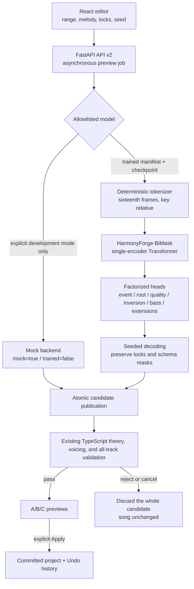
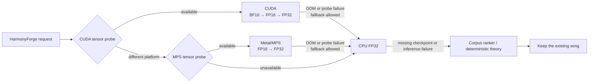

# HarmonyForge neural-harmony preview architecture

[日本語](neural-harmony-architecture.ja.md) | **English**

Status: v0.4 research-preview foundation. The model implementation and API
contract exist, but this repository does not bundle a trained checkpoint or
completed quality evaluation.

## User safety contract

- Neural output is always a candidate and never writes directly to the project.
- A candidate remains `adoptable: false` until the existing TypeScript theory,
  schema, voicing, and all-track validators accept it.
- Only an explicit Apply action may copy a validated preview into the song.
- Cancellation, a missing checkpoint, inference failure, or schema rejection
  never stores a partial candidate.
- The development mock is reported as `mock: true`, `trained: false`, and
  `evaluationStatus: notEvaluated`; it is not presented as a trained neural model.
- A normal checkout without a trained checkpoint continues to use the empirical
  corpus and deterministic theory paths.

## Implemented path

`POST /api/v2/harmony/generate` creates a job and
`GET /api/v2/jobs/{requestId}` reports progress.
`POST /api/v2/harmony/cancel/{requestId}` cooperatively interrupts the job and
rechecks cancellation immediately before publishing completed candidates.
`GET /api/v2/models/{modelId}/manifest` exposes model availability and provenance.

## Implemented v0.4 model

| Item | Implementation |
| --- | --- |
| Model ID | `harmonyforge-bimask-base-v1` |
| Family | Bidirectional masked Transformer with time-aligned melody and harmony |
| Encoder | 12 layers, hidden 768, 12 heads, FFN 4096, pre-norm, GELU |
| Position | Learned position within each 256-frame window, plus bar and sixteenth-position embeddings |
| Context | Melody tokens, harmony tokens, and bar-summary tokens |
| Extension conditioning | Existing extension multi-hot vector through a bias-free 8→768 projection |
| Output | Factorized event, root, quality, inversion, bass, and extension heads; function/cadence heads are architecture-only and are not trained by the v0.4 reference CLI |
| Size | **104,567,874 parameters**, checked with the same formula as the module |
| Artifact | One `SafeTensors` checkpoint and a strict JSON manifest |
| Devices | The same checkpoint on CUDA, Apple Metal/MPS, and CPU |
| Determinism | Request-local seed material, a fixed tokenizer SHA-256, and stable candidate IDs |

In v0.4, one model forward processes one tokenizer window
(`candidate_decoding_batch: 1`), and the requested 1–32 candidates are sampled
from the shared logits with a seed. API `candidateCount` is not the execution
batch size. OOM batch shrinking is not implemented; the adapter records the
reason and falls back to an allowed CPU path.

The implemented model does **not** use the rotary or relative positional
attention considered in the research plan. v0.4 uses the standard PyTorch
`TransformerEncoder` with learned window-position, bar, and metre embeddings.
Rotary/relative attention, sparse attention, stepwise SCG guidance, and a causal
student remain future research variants, not shipped v0.4 behavior.

## Browser-local TIS contour reranking

Independent of the neural path, automatic functional-harmony sections may opt
into `tonalTension: { enabled: true }`. Each newly evaluated planner
group/section evaluates eight candidates from the existing
`generateProgression`: candidate 0 keeps the planner-selected catalog
`progressionId` and original section seed as the baseline; candidates 1–7
explicitly clear `progressionId` and use derived streams for functional-harmony
alternatives. Derived candidates with `style: random` are pinned to candidate
0's resolved concrete style, while cadence remains governed by each candidate's
existing constraints. Compatible repeated sections in the same group reuse the
cached result, so they do not trigger eight new evaluations. A top-level
explicit named `progressionId` is applied to every section in a song form and
bypasses this path. An assembled arrangement does not enter this reranking path
at all: its source sections are generated independently and assembled later.
Functional-harmony off, the setting off, fewer than two unique candidates, or a
metric failure returns candidate 0 unchanged.

Repeated planner groups sharing a progression ID share the derived candidate
stream, concrete style, and selected original candidate index. Compatible
repeated sections reuse the selected result, preserving AABA and returning
verse/chorus restatements.

Successfully evaluated sections carry `tonalTensionApplied: true`. A catalog
baseline winner retains its catalog ID and shows both catalog and TIS reasons;
a functional winner removes the catalog ID. Range-based regeneration uses
candidate 0 and removes the TIS marker only when a section has at least one
actually replaced unlocked bar; a fully locked overlapping section retains its
marker and untouched sections retain theirs.

Each chord maps a 12-dimensional chroma count to weighted DFT bins `k=1..6`
with weights `[2,11,17,16,19,7]`. The profile uses chord distance normalized by
`64.8757`, key/function angles, dissonance
`1 - ||T|| / sqrt(sum(weights^2))`, and circular/non-bijective voice leading.
Its total is `chordDistance + 1.58*keyDistance + tonalFunctionDistance +
30.3*dissonance + 2.71*voiceLeading`. Existing energy plans are aggregated into
integer-tick, section-local bar curves; Pearson correlation is used when both
variances reach `1e-3`, otherwise the scale-safe fallback is `1` for two flat
curves, bounded inverse variance for a flat target, `-1` for a flat candidate
against a non-flat target, and Pearson otherwise. It compares no raw means.
Identity includes timing and sounding MIDI data, so voicing and doubling
differences are not deduplicated accidentally. The exact
`sqrt(sum(weights^2))` normalization is used; the rounded reference maximum is
not claimed to be bit-identical. The curve is computed before later pivot,
transition, hand assignment, and revoicing, so the final sound is not
guaranteed to have the same target. See the
[dedicated research note](research/tonal-tension-reranking.en.md) for equations
and primary sources.

This is not a Transformer, trained model, model weights, the 2020 hierarchical
tree term, or the full 2025 dual-level decoder. Listening improvement for this
app has not been evaluated, and published perceptual evaluation is mainly on
short major/minor progressions. The computation is dependency-free, deterministic,
offline, and local to the browser. It does not optimize cross-section absolute
tension or guarantee an exact match after later transition/postprocessing.

## Checkpoint gate

The real model is available only when every check passes:

- the allowlisted filename
  `harmonyforge-bimask-base-v1.safetensors`, `data-manifest.json`, and
  `training-run.json`;
- `task: melody_conditioned_variable_rhythm_harmonization`;
- `trained: true`;
- `evaluationStatus: researchOnly` or `validated`;
- `MTC_ENABLE_RESEARCH_CHECKPOINT=1` for a research-only artifact;
- matching architecture, actual config/checkpoint/data-manifest/training-run
  file SHA-256 values, and the fixed tokenizer digest;
- declared PyTorch version, minimum app/API version, and supported precision;
- CPU-safe `SafeTensors` loading, strict state-dict validation, and only then
  device placement.

`task` is checked ahead of every other gate and does not consult
`allow_research`. A `harmony_only_pretraining` artifact shares the architecture,
tokenizer, and config, so it satisfies every other check, yet it never reaches
inference; only the training, export, and evaluation paths accept one. Release
status and training objective are independent axes, and
`MTC_ENABLE_RESEARCH_CHECKPOINT=1` relaxes the former alone. No setting or
environment variable opens the boundary.

Missing, untrained, unevaluated, corrupt, checksum-mismatched, or
wrong-objective artifacts return `available: false` or a safe job failure. They
never produce a disguised fallback candidate.

Runtime verifies the exported `data-manifest.json` file itself. Before export,
the compiler binds every ledger source checksum to the exact normalized input
JSONL bytes and verifies the hashes of its split,
vocabulary, and statistics artifacts. Dataset rights and leakage review remain
separate release gates.

## Devices and fallback

This diagram describes platform selection, not an attempt to run every platform
sequentially on one computer. NVIDIA systems select CUDA, supported Apple Silicon
selects MPS, and other systems select CPU. An accelerator failure moves to CPU
only when the request permits it. If neural CPU inference also cannot complete,
the client retains the song and uses the existing corpus/theory workflow.

`PYTORCH_ENABLE_MPS_FALLBACK=1` is never silently reported as Metal execution.
The adapter moves explicitly to CPU and records a fallback reason in the job and
Diagnostics.

## Ideas adopted from prior work

| Idea | Primary source | Treatment here |
| --- | --- | --- |
| Sixteenth-note frames and variable harmonic rhythm | AutoHarmonizer | Deterministic tick-to-frame alignment |
| Constrained regeneration of arbitrary spans | DeepBach and masked harmonization work | Generate / preserve / condition-only masks |
| Full-to-full masking curriculum | Kaliakatsos-Papakostas et al. (2026) | Training plan; no result is claimed yet |
| Harmony-representation comparison and factorization | Harmony-tokenization research | Multiple output heads instead of one flat class |
| Forward evaluation of non-differentiable rules | Stochastic Control Guidance | Final validator rejection now; stepwise guidance is not implemented |
| Offline teacher and future causal student | ReaLchords | Future variant; v0.4 is bidirectional |
| Aligned melody/chord/beat/key data | POP909 | Data-compiler and evaluation plan; raw songs are not bundled |
| Large heterogeneous harmony annotations | ChoCo | Candidate for future, subset-by-subset licensed pretraining |

## Repository-specific implementation

The following is application-specific integration engineering rather than a
verbatim implementation of a cited algorithm. We do not claim it as a novel
machine-learning method.

- strict API v2 types, allowlisted model IDs, and idempotent request IDs;
- tokenizer/config/checkpoint/data-manifest-file verification gates;
- real CUDA/MPS tensor probes and visible fallback provenance;
- background jobs, cancellation, and atomic candidate publication;
- the `adoptable: false` client-theory-validation boundary;
- preview → Apply → Undo integration with Draft / Committed / History;
- precedence that keeps neural, empirical, and preference scores below hard rules;
- explicit separation of mock, research-only, and validated checkpoints.

## Primary sources and official repositories

- Wu et al., [AutoHarmonizer](https://arxiv.org/abs/2112.11122) /
  [official repository](https://github.com/sander-wood/autoharmonizer)
- Wu et al., [ReaLchords](https://proceedings.mlr.press/v235/wu24c.html)
- Huang et al.,
  [Symbolic Music Generation with Non-Differentiable Rule Guided Diffusion](https://proceedings.mlr.press/v235/huang24g.html) /
  [official repository](https://github.com/yjhuangcd/rule-guided-music)
- Kaliakatsos-Papakostas et al.,
  [full-to-full curriculum masking](https://arxiv.org/abs/2601.16150)
- Kaliakatsos-Papakostas et al.,
  [harmony-tokenization comparison](https://doi.org/10.3390/info16090759)
- Hadjeres et al., [DeepBach](https://proceedings.mlr.press/v70/hadjeres17a.html)
- Wang et al., [POP909 paper](https://archives.ismir.net/ismir2020/paper/000089.pdf) /
  [dataset repository](https://github.com/music-x-lab/POP909-Dataset)
- de Berardinis et al., [ChoCo](https://doi.org/10.1038/s41597-023-02410-w)
- PyTorch:
  [CUDA semantics](https://docs.pytorch.org/docs/stable/notes/cuda.html),
  [MPS backend](https://docs.pytorch.org/docs/stable/notes/mps.html),
  and [reproducibility](https://docs.pytorch.org/docs/stable/notes/randomness.html)
- Apple,
  [Accelerated PyTorch training on Mac](https://developer.apple.com/metal/pytorch/)
- Hugging Face,
  [SafeTensors repository](https://github.com/huggingface/safetensors)

See the
[prior-work and state-of-the-art review](research/neural-harmonization-sota.en.md)
for the research comparison and the
[HarmonyForge implementation plan](research/neural-chord-model-plan.en.md)
for experimental gates.
