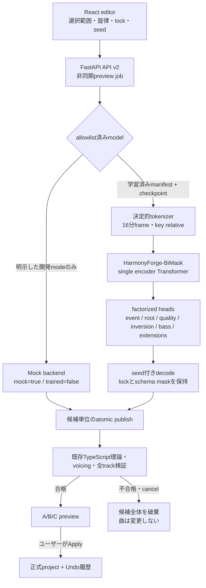
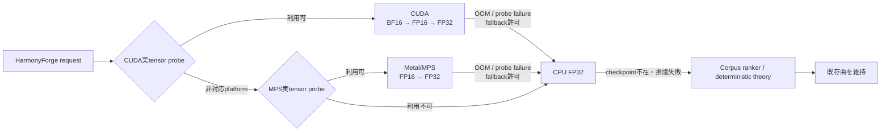

# HarmonyForge ニューラル和声プレビューのアーキテクチャ

**日本語** | [English](neural-harmony-architecture.en.md)

状態: v0.4研究プレビュー基盤。モデル実装とAPI契約は存在するが、学習済み
checkpointと品質評価結果はリポジトリに同梱していない。

## ユーザーに対する安全契約

- ニューラル出力は常に候補であり、正式な曲を直接変更しない。
- 候補はTypeScript側の既存理論・schema・全track検証を通るまで
  `adoptable: false` のままにする。
- 検証済みpreviewをユーザーが明示的にApplyしたときだけ曲へ反映する。
- cancel、checkpoint不在、推論失敗、schema拒否では候補を部分保存しない。
- 開発用mockは`mock: true`、`trained: false`、
  `evaluationStatus: notEvaluated`として表示し、本物のニューラルモデルと呼ばない。
- 学習済みcheckpointがない通常checkoutでは、既存のコーパス／決定的理論経路を
  継続して使える。

## 実装済みの処理経路

`POST /api/v2/harmony/generate`はjobを作成し、
`GET /api/v2/jobs/{requestId}`で進捗を取得する。
`POST /api/v2/harmony/cancel/{requestId}`は協調的に中断し、完了候補を公開する直前に
cancel状態を再確認する。model manifestは
`GET /api/v2/models/{modelId}/manifest`で取得できる。

## 実装済みv0.4モデル

| 項目 | 実装 |
| --- | --- |
| Model ID | `harmonyforge-bimask-base-v1` |
| Family | melody/harmonyを時間整列したbidirectional masked Transformer |
| Encoder | 12 layers、hidden 768、12 heads、FFN 4096、pre-norm、GELU |
| Position | 256-frame window内のlearned positionと、bar・16分位置embedding |
| Context | melody token、harmony token、bar summary token |
| Extension conditioning | 既存extension multi-hotをbiasなし8→768 projectionで入力 |
| Output | event、root、quality、inversion、bass、extensionsのfactorized heads。function/cadence headはarchitectureのみで、v0.4 reference CLIでは学習しない |
| Size | **104,567,874 parameters**（実装moduleと同じ式で検証） |
| Artifact | 1つの`SafeTensors` checkpointと厳格なJSON manifest |
| Devices | 同じcheckpointをCUDA、Apple Metal/MPS、CPUで使用 |
| Determinism | request-localなseed material、固定tokenizer SHA-256、安定したcandidate ID |

v0.4では1回のmodel forwardが扱うtokenizer windowは1つ
（`candidate_decoding_batch: 1`）で、要求された1〜32候補は同じlogitsから
seed付きでsamplingする。APIの`candidateCount`は実行batch sizeではない。
OOM時のbatch縮小は未実装で、理由を記録して許可されたCPUへfallbackする。

現在の実装は、計画で候補に挙げたrotary／relative positional attentionを
採用していない。PyTorch標準`TransformerEncoder`と、
learned window position + bar/metre embeddingを採用した。
rotary／relative attention、sparse attention、SCG型stepwise guidance、
causal studentは比較実験後に判断する研究variantであり、v0.4実装済み機能ではない。

## ブラウザ内TIS緊張カーブ再順位付け

ニューラル経路とは独立に、機能和声が自動生成するセクションへ任意の
`tonalTension: { enabled: true }`を適用できます。新しく評価するplanner group/sectionごとに
既存`generateProgression`から8候補を評価し、
候補0はplannerが付けたcatalog `progressionId`と元のsection seedをbaselineとして使います。
候補1〜7は`progressionId`を明示的に外した機能和声候補で、派生seedを使います。`style: random`
の派生候補は候補0の解決済みstyleを共有し、cadenceは各候補の既存制約に従います。
同じgroupの互換する反復sectionはcached resultを再利用するため、8候補の新規評価を繰り返しません。
top-levelの明示的な`progressionId`はsong formの全sectionへ実際に適用し、この経路をバイパスします。
組み立て済みarrangementはこの再順位付け経路へ入らず、source sectionを独立生成して後からassembleします。
機能和声OFF、設定OFF、重複2候補未満、または計算失敗なら候補0へ戻ります。

同じprogression IDを持つplanner反復groupは、派生candidate stream、具体化されたstyle、選択した
original candidate indexを共有します。互換する反復sectionでは選択結果も再利用し、AABAや戻る
verse/chorusのrestatementで新しいstreamを黙って発生させません。

正常評価されたsectionだけ`tonalTensionApplied: true`を持ちます。catalog baselineが勝てば
catalog IDとTIS理由を両方残し、機能和声候補が勝てばcatalog IDを外します。partial regeneration
ではsection-wideなTIS適用を主張せず、候補0を使い、unlocked barを1つ以上実際に置換したsection
だけTIS markerを外します。範囲が重なっても全bar lockedのsectionと未接触sectionのmarkerは保持します。

各コードを12次元chroma countから重み付きDFT（`k=1..6`, weights
`[2,11,17,16,19,7]`）へ写像し、`64.8757`正規化のchord距離、key/function角度、
`1 - ||T|| / sqrt(sum(weights^2))` dissonance、circular/non-bijective voice-leadingを
用います。合計は `chordDistance + 1.58*keyDistance + tonalFunctionDistance +
30.3*dissonance + 2.71*voiceLeading` です。既存energy planをsection-localな整数tick bar
curveへ集約し、分散が`1e-3`以上ならPearson、その他はraw meanを比較しないscale-safeな
flatness fallback（両方flat=1、flat targetは`1/(1+variance)`、flat candidateは`-1`）で再順位付けします。
identityはtimingとsounding MIDI dataを含むので、voicingやdoublingを誤ってdedupeしません。dissonanceは
厳密な`sqrt(sum(weights^2))`で正規化し、丸められた参照最大値とのbit単位一致は主張しません。曲線は
後段のpivot／transition／左右手割当／再voicing前に計算するため、最終出音のtarget一致も保証しません。
詳細な式と参照は[専用研究ノート](research/tonal-tension-reranking.ja.md)を
参照してください。

これはTransformer、学習済みweight、2020年モデルのhierarchical-tree項、または2025年論文の
完全なdual-level decoderではありません。このアプリでの聴感改善も未評価で、公開評価は主に
major/minorの短い進行です。計算は依存なし・決定的・offlineのブラウザ内処理です。section間の
絶対レベルや、後段のtransition/postprocess後の最終曲線の完全一致は保証しません。

## Checkpoint gate

実モデルは次のすべてを満たすまでavailableにならない。

- allowlist済みの固定file名
  `harmonyforge-bimask-base-v1.safetensors`、`data-manifest.json`、
  `training-run.json`
- `task: melody_conditioned_variable_rhythm_harmonization`
- `trained: true`
- `evaluationStatus: researchOnly`または`validated`
- research-only artifactでは`MTC_ENABLE_RESEARCH_CHECKPOINT=1`
- architecture、config/checkpoint/data-manifest/training-run実file SHA-256、
  固定tokenizer digestの一致
- PyTorch version、minimum app/API version、supported precisionの宣言
- `SafeTensors`をCPUへ安全に読み、strictなstate-dict検査後にdeviceへ移動

`task`は他のどのgateよりも先に検査し、`allow_research`を経由しない。
和声のみで学習した`harmony_only_pretraining` artifactは同一architecture・
同一tokenizer・同一configを持つため他の検査をすべて通過するが、推論経路へは
入れない。学習・書き出し・評価の各経路だけが明示的にこれを受理する。
release statusと目的関数は独立な軸であり、
`MTC_ENABLE_RESEARCH_CHECKPOINT=1`は前者だけを緩める。
境界を開く設定項目・環境変数は存在しない。

artifactがない、未学習、未評価、破損、checksum不一致、目的関数が異なる場合、
偽の候補を返さず`available: false`または安全なjob failureにする。
runtimeはexport済み`data-manifest.json`そのもののhashを検証する。export前には
compilerがledgerのsource checksumをnormalized input JSONLの実bytesにbindし、
split / vocabulary / statistics artifactのhashを
検証し、データ権利・leakage評価は別のrelease gateとして残す。

## Deviceとフォールバック

これは全platformを1台で順番に試すという意味ではない。NVIDIA環境ではCUDA、
対応Apple SiliconではMPS、それ以外ではCPUを選び、accelerator失敗時は
許可された場合だけCPUへ移る。CPUでもニューラル推論を完了できない場合、
クライアントは既存コーパス／理論生成を使い、現在の曲を維持する。

`PYTORCH_ENABLE_MPS_FALLBACK=1`によるsilent operation fallbackはMetal実行として
報告しない。明示的にCPUへ切り替え、fallback reasonをjobとDiagnosticsへ残す。

## 先行研究から採った考え方

| 考え方 | 参照した一次資料 | 本実装での扱い |
| --- | --- | --- |
| 16分音符frameと可変ハーモニックリズム | AutoHarmonizer | tick契約を16分frameへ決定的に整列 |
| 任意範囲の条件付き再生成 | DeepBach、masked harmonization研究 | generate / preserve / condition-only mask |
| full-to-full masking curriculum | Kaliakatsos-Papakostas et al. (2026) | training計画。学習結果は未報告 |
| 和音表現の比較とfactorization | Harmony tokenization研究 | flat 1クラスでなく複数head |
| 非微分可能ruleをforward評価 | Stochastic Control Guidance | 現在は最終validator reject。stepwise guidanceは未実装 |
| offline teacherと将来のcausal student | ReaLchords | 将来variant。v0.4はbidirectional |
| melody/chord/beat/keyの整列data | POP909 | data compilerと評価計画。raw曲は同梱しない |
| 大規模な異種和声annotation | ChoCo | 将来の許諾subset別pretraining候補 |

## このリポジトリ独自の実装

次は引用論文のアルゴリズムをそのまま移植したものではなく、このアプリ向けの
integration engineeringである。新しい機械学習手法としての新規性は主張しない。

- API v2の厳格な型、allowlist model ID、request IDの冪等性
- tokenizer/config/checkpoint/data-manifest実fileの検証gate
- CUDA/MPSの実tensor probeとsilent fallbackの可視化
- background job、cancel、候補単位のatomic publish
- `adoptable: false`から始めるclient theory validation境界
- Draft / Committed / Historyと連携するpreview → Apply → Undo
- ニューラル、経験コーパス、明示選好をハード理論制約より下位に置く優先順位
- 未学習mock、research-only checkpoint、validated checkpointの明確な表示分離

## 一次資料・公式repository

- Wu et al., [AutoHarmonizer](https://arxiv.org/abs/2112.11122) /
  [official repository](https://github.com/sander-wood/autoharmonizer)
- Wu et al., [ReaLchords](https://proceedings.mlr.press/v235/wu24c.html)
- Huang et al.,
  [Symbolic Music Generation with Non-Differentiable Rule Guided Diffusion](https://proceedings.mlr.press/v235/huang24g.html) /
  [official repository](https://github.com/yjhuangcd/rule-guided-music)
- Kaliakatsos-Papakostas et al.,
  [full-to-full curriculum masking](https://arxiv.org/abs/2601.16150)
- Kaliakatsos-Papakostas et al.,
  [harmony tokenization comparison](https://doi.org/10.3390/info16090759)
- Hadjeres et al., [DeepBach](https://proceedings.mlr.press/v70/hadjeres17a.html)
- Wang et al., [POP909 paper](https://archives.ismir.net/ismir2020/paper/000089.pdf) /
  [dataset repository](https://github.com/music-x-lab/POP909-Dataset)
- de Berardinis et al., [ChoCo](https://doi.org/10.1038/s41597-023-02410-w)
- PyTorch:
  [CUDA semantics](https://docs.pytorch.org/docs/stable/notes/cuda.html),
  [MPS backend](https://docs.pytorch.org/docs/stable/notes/mps.html),
  [reproducibility](https://docs.pytorch.org/docs/stable/notes/randomness.html)
- Apple,
  [Accelerated PyTorch training on Mac](https://developer.apple.com/metal/pytorch/)
- Hugging Face,
  [SafeTensors repository](https://github.com/huggingface/safetensors)

詳細な研究比較は
[ニューラル和声生成：先行研究・最先端比較](research/neural-harmonization-sota.ja.md)、
実験gateは
[HarmonyForge ニューラルコード生成モデル実装計画](research/neural-chord-model-plan.ja.md)
を参照。
